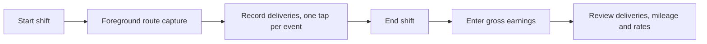

---
hide:
  - navigation
---

# DashPilot

  

DashPilot is a native, local-first iOS companion for delivery drivers. It measures shifts,
deliveries, routes, recorded mileage and gross earnings on device, so a driver can see how their
work actually performed without handing that history to a server.

It is a general delivery-driver tool. It has no integration with DoorDash or any other delivery
platform, it does not observe, automate or interfere with those apps, and anything that cannot be
derived legitimately from device sensors and stored history is either typed by the driver or left
out.

## Who it is for

Drivers who want a truthful record of their own work: how long a shift ran, how much of it was
recorded, what it paid, and what those two facts imply per hour and per recorded mile. It is also
a worked example of a small SwiftUI and SwiftData application that takes persistence, permissions,
monetary precision and honest wording seriously.

## The workflow that exists today

One shift runs at a time, and one delivery within it. While the shift runs and DashPilot is in the
foreground, accepted positions are recorded against it, and one large control records each delivery
event the driver taps. When the shift ends, the driver may type what it paid, and the completed
shift's detail screen states what each delivery recorded, the shift's recorded mileage, the shape of
its route, and two derived rates together with the reason either one could not be derived.

[Read the shift workflow](product/shift-workflow.md){ .md-button .md-button--primary }
[Read the delivery lifecycle](product/delivery-lifecycle.md){ .md-button }
[See what is and is not implemented](product/overview.md){ .md-button }

## Engineering characteristics

- **First-party frameworks only.** SwiftUI, SwiftData, Core Location, OSLog, Swift Testing and
  XCUITest. There are no third-party runtime dependencies.
- **Versioned persistence.** The schema has been versioned since v1 and carries a migration plan
  exercised by tests that open stores written under every older version. See
  [Migrations](architecture/migrations.md).
- **Nothing derived is stored.** Recorded mileage, a delivery's state and both rates are recomputed
  from the stored route, timestamps and amount every time they are shown, so the store never holds
  two answers to the same question.
- **Decimal money.** No monetary value passes through binary floating point, in memory or in the
  store. See [Money and metrics](architecture/money-and-metrics.md).
- **Deliberate location handling.** Authorization, accuracy, the system-wide Location Services
  switch, sample filtering and capture continuity are modelled separately and tested separately.
  See [Location](architecture/location.md).
- **Testable without the UI.** Domain types import neither SwiftUI nor SwiftData, so every
  calculation is verified without a container or a rendered view.

## What it deliberately does not do

- No delivery-platform account, credential, import, scraping or automation of any kind.
- No accounts, no sync, no analytics, no telemetry, no advertising and no network code at all.
- No background route capture. Capture is foreground-only, so a route has a gap whenever the app
  was not open, and DashPilot says so instead of guessing across it.
- No claim that recorded mileage equals the miles driven, and no tax or deduction figure.
- No profit, take-home or net earnings. Gross earnings are one number the driver typed.
- No automatic delivery detection. Every delivery event is one the driver recorded.
- No machine learning, no offer recommendations and no automated decisions.

The full list, including the parts that are simply not built yet, is on
[Limitations](reference/limitations.md).

## Where to go next

| Section | What it covers |
| --- | --- |
| [Product](product/overview.md) | What the app does today, screen by screen, and what it does not claim |
| [Architecture](architecture/overview.md) | Layering, persistence, location, measurement, money and privacy |
| [Development](development/building.md) | Building, testing and how the repository is organised |
| [Reference](reference/data-model.md) | The stored data model and the current limitations |

!!! note "Documentation status"

    This site documents schema v5 and the shift, route, earnings, metrics, detail and delivery
    lifecycle work completed so far. Every amount, coordinate and route in it is synthetic.
