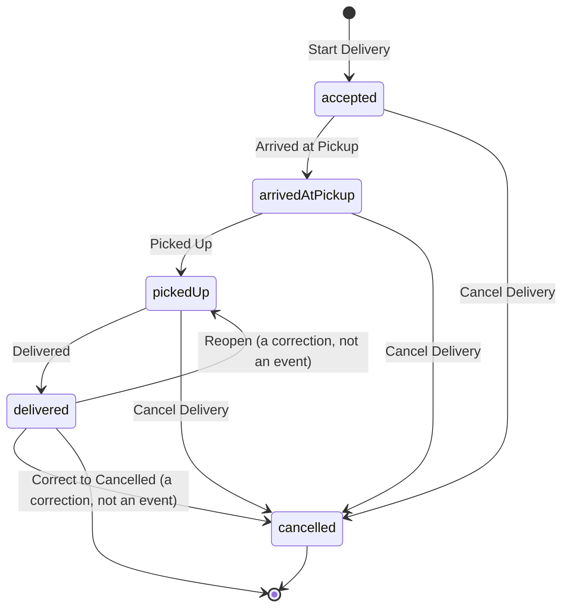

# Delivery lifecycle

A shift answers *when were you working*. A delivery answers *what were you doing inside it*. This
page describes what DashPilot records about a delivery, what it deliberately does not, how several
deliveries worked at once are kept apart, and what happens to a delivery that is still running when
the app is closed.

!!! warning "Nothing here is detected"

    Every timestamp on a delivery exists because the driver tapped a control. DashPilot has no
    integration with DoorDash or any other delivery platform: it does not read an order, watch
    another app, scrape a screen, intercept traffic or infer a pickup from movement. A delivery the
    driver did not record is not in the app, and a state they did not tap is not claimed.

## The five states

The two edges that are not events are the corrections that change *which* terminal event a delivery
records, and both act on a delivery recorded as delivered by mistake. Which one applies depends on
the **shift**, not on the delivery:

- While the shift is still **running**, `Reopen` records nothing: it **removes** the delivered
  timestamp and the delivery goes back to the state its remaining timestamps already describe, so the
  driver can finish it properly. See
  [Taking back a delivery marked delivered by mistake](#taking-back-a-delivery-marked-delivered-by-mistake).
- Once the shift has **ended**, nothing can finish a delivery, so `Correct to Cancelled` records the
  ending that actually happened instead. The delivery stays terminal. See
  [Correcting a completion after the shift has ended](#correcting-a-completion-after-the-shift-has-ended).

A third correction changes no edge at all. Once the shift has ended, the instants a delivery recorded
can be corrected **in place**: same stages, same terminal event, different times. See
[Correcting the times a delivery recorded](#correcting-the-times-a-delivery-recorded).

| State | What it means | Recorded by |
| --- | --- | --- |
| `accepted` | The driver took the offer and is heading to the pickup | Creating the delivery |
| `arrivedAtPickup` | They reached the pickup and are waiting | `arrivedAtPickupAt` |
| `pickedUp` | The order is in the car | `pickedUpAt` |
| `delivered` | The delivery was completed. Terminal | `deliveredAt` |
| `cancelled` | It ended without being completed. Terminal | `cancelledAt` |

Acceptance is the delivery's creation rather than a separate optional timestamp. A delivery that
has not been accepted is a delivery that does not exist, so an optional `acceptedAt` would describe
a state the app can never be in.

## State is the timestamps

There is no stored `state` column and no `isPickedUp`-style flags. The state is derived from which
timestamps exist, so there is exactly one authoritative answer to what a delivery is doing, and it
is the same data that forms the historical record. A stored state could drift out of step with the
events it claims to summarise; a derived one cannot.

## Cancellation is history, not deletion

Real delivery work ends without a delivery: an order is cancelled, unassigned or returned.
Cancelling is available from every active state and keeps whatever genuinely happened first — a
delivery cancelled after twenty minutes at a pickup still records that the driver arrived there.

A cancelled delivery is never deleted, never counted as completed, and never folded into a single
total. It is work the driver did that did not end in a delivery.

## Taking back a delivery marked delivered by mistake

`Delivered` is one tap on a card the driver may be looking at from a kerb, and it is occasionally the
wrong card or a minute too early. DashPilot lets that one mistake be taken back.

**Reopening removes the delivered timestamp and nothing else.** There is no destination to choose,
because the timestamps that stay are the answer:

| What the delivery still records | What it goes back to |
| --- | --- |
| A pickup | `pickedUp`, heading to the customer |
| An arrival and no pickup | `arrivedAtPickup`, waiting at the pickup |
| Only the acceptance | `accepted`, heading to the pickup |

Only the first is reachable through the app, which refuses a completion before a pickup was recorded.
The other two are derived rather than refused so that a store holding such a row is returned to a
state a driver could really have been looking at.

Nothing else moves. `acceptedAt`, `arrivedAtPickupAt` and `pickedUpAt` keep the values they were
recorded with, the pickup place stays, and **no timestamp is written, shifted or invented anywhere**.
Nobody is asked to type a time. This is deliberately not a lifecycle editor: the only thing that can
be corrected through it is an accidental completion.

### Two ways to reach it

- **Undo**, offered at the top of the running shift's panel for the first few seconds after a
  delivery is marked delivered. It names the delivery, says aloud that the delivery becomes active
  again and which state it returns to, and takes no confirmation: the action it reverses happened
  seconds ago. The window does not start while the [expected pay](#expected-pay) confirmation is
  covering it, because an offer the driver cannot see is not one they were given.
- **`Reopen a Delivered Delivery`**, a small secondary control under the panel, for the mistake
  noticed at the next door. It lists the shift's delivered deliveries with the state each would
  return to, and every reopening there is confirmed by a sentence saying what will happen. It appears
  only once the shift holds a delivery recorded as delivered.

Neither is called `Edit`. Nothing here edits anything.

### Only while the shift is running

Reopening is refused on a shift that has **ended**, and on one that is **paused**.

Both refusals keep rules that already exist. A shift cannot be ended while a delivery is in progress,
so reopening one afterwards would leave an active delivery under a finished shift that nothing could
advance and no screen could resolve; and a delivery cannot be started while a shift is paused, so
reopening one during a pause would run delivery active time through hours the app reports as not
worked. **Reopening the shift itself is a separate decision DashPilot does not make**, silently or
otherwise.

A reopened delivery therefore only ever exists inside a running shift, which is what keeps every
completed-shift figure and every [period summary](period-summaries.md) out of it: those are built
from completed shifts, and this shift cannot be completed again until the delivery is delivered or
cancelled.

#### Why the ended-shift refusal is permanent

The refusal was re-examined on its own, against the question of whether a mistake noticed after the
shift ended could be corrected without turning that shift back into a working session. It was
measured rather than argued, by building the row the app refuses to create and reading what every
existing figure does with it. The answer is that **a completed shift cannot truthfully hold a
delivery corrected to a non-terminal state**, for three reasons, and the refusal stays.

**The correction would be one-way.** Reopening *removes* the delivered timestamp and writes none. On
a running shift the driver writes it back by finishing the delivery a few minutes later. On an ended
shift nothing can: every lifecycle write requires a running shift, so the delivery could never be
delivered again, never be cancelled, and never be reopened again either. A driver correcting one
mis-tap would permanently destroy a recorded fact and get nothing in its place.

**Non-terminal is a claim about now.** The states a reopening restores are present tense: `pickedUp`
is "heading to the customer", an offer holding an active delivery is "in progress", and a shift's
delivery counts say one is "still in progress". None of that can be true of work that finished hours
ago, and the app would be asserting it on the completed shift's own screen, in its
[period summaries](period-summaries.md) and in its [export](history-export.md).

**The figures would quietly get worse.** Delivery active time is the union of intervals that have
ends, and a reopened delivery has none, so the shift's active time falls short of its sources with
nothing on screen saying so, and a shift whose only delivery was reopened reports no measurable
delivery active time at all. A gross amount recorded against the delivery survives the reopening by
design, while the count of deliveries eligible to carry one does not, so a period would print more
contributors than eligible records.

**What a driver actually wants here is a different feature.** A historical `Delivered` is wrong in
one of two ways: the time is off by a few minutes, or the delivery never completed. The first is a
timestamp correction and the second is taking back a completion as a *cancellation*. Neither is
served by removing a timestamp and leaving the delivery to claim it is still being worked.

The second of those is now built, and it is the section below. The first is not, and is still a
[limitation](../reference/limitations.md).

Two things were confirmed safe and are worth recording, because they were the obvious hazards: the
shift's end timestamp is the only thing route capture and the [Live Activity](live-activity.md) read,
so neither would restart for a completed shift whatever its deliveries say. That is not enough to
make the correction truthful, but it means the refusal rests on domain semantics rather than on a
fear of waking a background service.

### What is refused rather than guessed

- **A cancelled delivery.** Taking back a cancellation is a different statement with different
  consequences, and this version has not decided them. It is refused and said, not treated as the
  same correction.
- **A delivery that is not recorded as delivered**, which is what a second press meets. Nothing is
  written the second time.
- **A store whose remaining timestamps do not describe a state the lifecycle can produce**: a pickup
  with no arrival before it, or times that run backwards. The row says two contradictory things and
  does not say which one is the mistake, so nothing is removed and the screen states why.

### What it does not touch

**Money is not deleted.** A gross amount recorded against the delivery stays recorded, and so does an
expected amount. A lifecycle correction is not an instruction to remove a figure the driver entered,
and neither amount is converted into the other. Recording a *new* gross amount is still refused while
the delivery is active, which is a rule about writing rather than about holding; an expected amount
becomes editable again with the delivery.

Its **delivery active time** derives exactly as any unfinished delivery's does: the interval is open,
so it is counted as unfinished rather than measured, and what it earned per recorded delivery hour
is unavailable until it is delivered again. The shift counts it among the deliveries in progress rather
than the completed ones, because that is what it is.

Nothing about **which deliveries arrived together** moves. The offer keeps its deliveries, its
siblings are untouched, and an offer that was terminal becomes active again because one of its
deliveries is. See [Correcting one](#correcting-one) for the correction that moves membership and no
lifecycle state, which is the mirror of this one.

The shift's [Live Activity](live-activity.md) is reconciled from the store like every other change:
the active count, the completed count and the controls follow, and a control drawn a moment before is
refused by the service rather than trusted.

**It is in the app only**, not on the Live Activity and not by voice, for the reason cancelling a
delivery is not: a correction aimed at one of several deliveries needs a screen that can name them.

## Correcting a completion after the shift has ended

A driver ends the shift, reads its history, and finds a delivery recorded as delivered that never
completed. Reopening it is refused for the reasons above, and it would be the wrong repair anyway:
there is no shift left to finish the delivery in. So DashPilot records the ending that actually
happened instead. `Correct to Cancelled`, on the delivery's own row in the finished shift's history.

**The delivery stays terminal.** That is the whole difference between this correction and reopening,
and it is why a finished shift can carry it:

| Before | After |
| --- | --- |
| Terminal as `delivered` | Terminal as `cancelled` |
| `deliveredAt` recorded | `deliveredAt` gone |
| no `cancelledAt` | `cancelledAt` recorded |

### The cancellation time is the completion time

**The instant the driver recorded as the completion becomes the cancellation.** Nothing is typed and
nothing is invented, which is the rule the running-shift correction already rests on.

It is the right instant rather than merely an available one: it is the only recorded time that
represents the driver saying this delivery stopped being active, which is exactly what a cancellation
timestamp means. The consequences are what make the correction safe on a shift every historical
figure is built from:

- the delivery's own **active interval** is unchanged, because it ends at `deliveredAt` or
  `cancelledAt` and that instant has not moved;
- the shift's **delivery active time**, which unions those intervals, is unchanged to the second, and
  so is the non-delivery time derived from it;
- the shift's **working duration**, its **recorded mileage**, its **recorded pickup waits** and the
  **period** it is reported in are all untouched;
- the shift stays **ended** and gains no delivery in progress, so nothing about it re-enters the
  present tense.

`.now` was the alternative and is refused: it would record a cancellation hours after the shift
ended, outside the shift that contains it and outside the period that shift is counted in.

### What moves, and what deliberately goes

The shift counts a cancellation where it counted a completion, and the offer the delivery arrived in
is re-derived: an offer whose deliveries are now all cancelled reads `All deliveries cancelled`, and
one with some of each reads `Partly completed, partly cancelled`. No offer timestamp and no offer
membership is rewritten.

Two derived figures go with the completion, by their own existing definitions rather than by any
decision made here: the delivery's **accepted to delivered** duration, and what it **earned per
recorded delivery hour**. Both need a completion to measure to, and a cancelled delivery has none. Deriving
them to the cancellation instead would put a figure in the same column as deliveries that finished.

### Money is not deleted

A **gross amount** recorded against the delivery stays recorded. A cancelled delivery may truthfully
carry one, because compensation for a cancelled order is real, and DashPilot has never required a
cancelled delivery to be zero. An **expected amount** stays too. Neither is converted into the other,
and no refund, clawback or platform adjustment is invented: the correction is a statement about how
the delivery ended, not about what it paid.

### What is refused

- **A shift that has not ended**, including a paused one. While a shift is running the mis-tap is
  reopened and finished properly, and rewriting it into a cancellation there would discard a
  completion the driver is about to record for real.
- **A delivery that is not recorded as delivered.** A delivery already recorded as cancelled is
  already terminal as what it was, and this is what a second press meets: nothing is written the
  second time.
- **A store whose timestamps contradict each other**: a pickup with no arrival before it, or times
  that run backwards. Nothing is repaired, for the reason the reopening repairs nothing.

Each refusal is stated rather than hidden, and the control is not offered at all on a row it would
refuse.

### Nothing about the shift restarts

The shift is not reopened, no delivery becomes active inside it, no route capture session begins, no
[Live Activity](live-activity.md) is requested, and no lifecycle control appears anywhere. All of
those read the shift's own end timestamp, and the correction writes two attributes of one delivery.

The control says `Correct to Cancelled` rather than `Cancel Delivery`, which is the running shift's
control for work falling through now, and rather than `Edit`, which would promise a lifecycle editor
DashPilot does not have. Every correction is confirmed by a sentence that names the delivery and says
what will happen to it.

## Correcting the times a delivery recorded

DashPilot can be unreachable at the moment work actually happens. It is evicted under memory
pressure, it crashes, or it is replaced by a new build mid-shift. The driver keeps delivering, and
the events land in the app whenever it comes back — so a delivery records a completion long after the
order reached the door.

`Correct Times`, on the delivery's own row in a finished shift's history, opens one sheet holding a
picker for **each instant the delivery already records**. Nothing else is on it.

### It corrects facts and creates none

| Correctable | Only when already recorded |
| --- | --- |
| `acceptedAt` | Always: a delivery that was not accepted does not exist |
| `arrivedAtPickupAt` | When the driver recorded reaching the pickup |
| `pickedUpAt` | When the driver recorded collecting the order |
| `deliveredAt` | On a delivery recorded as delivered |
| `cancelledAt` | On a delivery recorded as cancelled |

A stage the delivery never recorded has **no picker and no row**. A delivery cancelled on the way to
a pickup never arrived at one, and offering a control to say when it did would be an invitation to
invent an event. The same rule from the other side: no recorded event can be removed here, and the
terminal event cannot be swapped — that is `Correct to Cancelled`, which has its own name and its own
confirmation.

### Nothing cascades

Every proposed time has to leave the delivery temporally valid:

`acceptedAt` ≤ `arrivedAtPickupAt` ≤ `pickedUpAt` ≤ `deliveredAt` or `cancelledAt`

— over the stages that exist, and with every one of them inside the shift that holds the delivery.
Touching instants are in order, because two events can genuinely share a minute.

**A time that collides with another is refused, and the refusal names the other one.** A completion
dragged back behind its own pickup is not resolved by dragging the pickup back with it: that would
replace a second fact the driver recorded with one the app invented. The driver corrects that fact
too, in the same sheet, and the whole proposal is judged again. It is the rule a shift's end already
meets against a pause and against a delivery.

### What moves, and what does not

Nothing derived is stored anywhere in DashPilot, so every figure built from these instants follows a
correction with no recomputation step and no second stored answer:

| Moves | Does not move |
| --- | --- |
| The delivery's **accepted to delivered** duration | Its recorded gross amount, its expected amount and every additional tip |
| Its **recorded pickup wait** | Its terminal outcome: delivered stays delivered, cancelled stays cancelled |
| Its **effective earnings per recorded delivery hour** | The offer it arrived in, and every grouping built from that |
| The shift's **delivery active time**, and the non-delivery time derived from it | The pickup place it names |
| The **period** figures built on those | The shift's own start and end |

**The route and the recorded mileage are not changed.** Not one position is deleted, retimed,
re-coordinated or moved between capture sessions. This corrects what the driver recorded about the
delivery, not where the phone recorded being, and the sheet says so before anything is saved —
because a driver who has just moved a completion back by twenty minutes might reasonably expect the
mileage to fall with it.

### Finished deliveries on finished shifts only

The shift's own window is what gives the correction its bounds, so a shift that has not ended is
refused: it has no end for a recorded event to fall inside. It is also the right refusal on its own
terms. While the shift is running, a mis-tapped completion is **reopened** and finished properly,
which records the real instant instead of typing one.

An unfinished delivery is refused too. On a well-formed completed shift there is none, because a
shift cannot end while a delivery is active; the repair for the anomalous row that reaches it is to
record what happened, not to move what did not.

### Validated whole, written whole

The complete proposal is judged before anything is assigned, and one save follows. A refused save
leaves **every** original instant, not some of them, so there is no state in which a delivery's
pickup moved and its completion did not.

### It is what unblocks correcting a shift's end

[Correcting a shift's recorded end](shift-workflow.md#correcting-a-shifts-end-time) refuses to
move the end back past anything a delivery recorded, so one late completion pins the shift's end to
it. The refusal names the blocking delivery and event — `Delivery 1 has Delivered recorded at
9:47 PM, after the proposed shift end` — and the recovery is to correct that delivery here and then
propose the end again. Nothing corrects a delivery from the shift editor: the two are separate
records with separate confirmations.

## The rules, and where they live

These are enforced in `Delivery` and `DeliveryService` against the store, not by disabling a
button. A disabled control is presentation and cannot protect data.

- A delivery belongs to **exactly one shift** and can only begin while that shift is running. A
  delivery is never moved to another shift.
- **Any number of deliveries may be active at once.** Starting one changes nothing about the
  others.
- Every lifecycle event is applied to **exactly one delivery, named by the caller**. Nothing infers
  which delivery a tap meant.
- A delivery can only be advanced while the shift it belongs to is still running.
- Transitions happen **in lifecycle order, once each**, and never after the delivery has finished.
- A timestamp that precedes the last recorded event is **clamped forward**, which is the rule
  `ShiftService` already applies to a shift end when the device clock moves backwards. A driver must
  always be able to record what just happened, and a clamped event produces a zero-length interval
  rather than a negative one.
- Deleting a shift deletes its deliveries, through the relationship's cascade rule.

## Offers and deliveries

One accepted **offer** can contain more than one **delivery**, and the two are different facts:

| | What it is | What it holds |
| --- | --- | --- |
| Offer | One acceptance event: the driver was shown work and took it | When it was accepted, and the deliveries it contained |
| Delivery | One customer dropoff | Its own pickup, its own terminal event, its own amounts |

Every delivery belongs to exactly one offer, and every offer holds at least one delivery. One tap on
`Start Delivery` records an offer of one, which is the ordinary case. A driver who accepted two
dropoffs together records one offer holding two.

**An add-on offer is a different offer.** Accepting more work while deliveries are already running is
ordinary, and it records a new offer every time. Two offers whose deliveries overlap in time are
still two acceptances, and nothing merges them: overlapping lifetimes are what stacked work looks
like, and treating them as one would erase the fact that the driver decided twice.

The shapes this covers, all of which are ordinary in real work:

- one offer, one store, one customer
- one offer, one store, two customers
- one offer, two stores, two customers
- one offer, two stores, one customer, as far as the existing lifecycle can express it: a delivery
  records **one** pickup, so two pickups are two deliveries, and a customer who received both is a
  fact DashPilot does not record about either
- one offer running, and a second accepted later
- several offers running at once, with their deliveries at different points

!!! info "An offer is a grouping the driver recorded"

    DashPilot reads no delivery platform, sees no offer screen and receives no notification. An
    offer here holds no platform identifier, no pay figure, no distance estimate and no customer: it
    exists because the driver said how many deliveries they had just accepted.

### Each delivery still advances on its own

Grouping changes nothing about the lifecycle. One delivery of an offer can be picked up while
another is still waiting at a counter, and completing one leaves its siblings exactly as they were.
An offer is complete only when **every** delivery in it is terminal.

**Cancellation is per delivery.** There is no control that cancels an offer. An offer whose
deliveries all ended cancelled is cancelled; one with a mix is partly completed, which is neither a
completed offer nor a cancelled one and is never reported as either.

### An offer holds no money and no time

Expected pay and recorded gross earnings stay on the delivery they were recorded against. Nothing
sums them into an offer total, nothing divides an amount between the deliveries of an offer, and no
rate, duration or distance is derived for an offer anywhere in the app. A sum over deliveries with no
amount recorded would read each of them as having paid nothing, which is the allocation this project
refuses everywhere else.

Delivery active time is unchanged: it unions the intervals of a shift's deliveries, so two that
overlap count their shared minutes once whether or not they share an offer.

### Recording one

`Start Delivery` is untouched: one tap, one delivery, in an offer of one. The same is true of the
App Shortcut and the Live Activity button, which both go through the same service call.

Beside it on the running shift is one small secondary control, `Offer With Several Deliveries`. It
opens a sheet that asks **a count and nothing else**: no pickup place, no amount, no customer and no
name, because each of those is optional on a delivery and can be added later from its own card. The
confirm button repeats the number it will record.

The stepper's range is a control's bounds rather than a rule. The model refuses an offer below one
delivery and caps nothing above it, since how much work a driver accepted is a fact about their work.

### Showing one

The running shift's cards are arranged by the offer they arrived in. An offer that held more than
one delivery gets a heading over its cards saying so, and how many of them are still in progress once
some have finished; an offer of one gets no heading at all, which is exactly what the screen looked
like before offers existed.

The heading is a **label and never a control**. Nothing acts on an offer as a unit: each card keeps
its own next step, its own pickup and expected-pay controls and its own named cancel button.

VoiceOver hears the grouping on every card rather than only in the heading, and it names the
siblings: *Part of Offer 1, accepted together with Delivery 2*. A listener has no layout to refer
back to, so the sentence has to say which other cards belong with this one. The completed-shift
history states the same thing on the rows of a grouped offer.

### Correcting one

Grouping is recorded by hand, at a kerb, and it is occasionally wrong: two taps on `Start Delivery`
for what was really one stacked offer, or an offer of three that was really two and a separate one.
`Correct Grouping`, under the two controls that record work and again in a completed shift's delivery
list, opens the one screen that fixes it. It appears only once a shift holds more than one delivery,
because grouping is a statement about more than one of them.

Four corrections are offered, and they are the same four operations underneath:

| Correction | What it does |
| --- | --- |
| Move a delivery | Records it under another offer of the same shift |
| Put a delivery in a new offer | Takes it out of the offer it shares and records it on its own |
| Combine two offers | Moves every delivery of one offer into another, then removes the offer left holding nothing |
| Separate an offer | Leaves its first delivery where it is and gives each of the others an offer of their own |

**A correction moves membership and nothing else.** Every lifecycle timestamp, pickup place, expected
amount, recorded gross and terminal state stays exactly where it was, on the delivery being corrected
and on every delivery of either offer. No figure the app derives moves either: shift gross, delivery
gross, delivery active time, recorded mileage, pickup waits, period totals and the Live Activity's
active count are all read from deliveries, and none of them asks which offer a delivery came in. The
one thing that changes anywhere is the grouping, including the `offerNumber` in an
[export](history-export.md).

**Neither acceptance timestamp is rewritten**, and the two are not required to agree. Two taps a
minute apart is the commonest mistake being corrected, so requiring a delivery's acceptance to equal
its offer's would refuse to fix it. The one rule enforced between them is that an offer may not come
to hold a delivery accepted **before the offer itself was**: an offer is an acceptance, and work
cannot have arrived in one that had not happened yet. That is refused explicitly rather than patched
by moving a timestamp, and an offer accepted too late is simply not offered as a destination.

A new offer created by a split or a separation takes the **earliest acceptance among the deliveries
moving into it**. That is a moment the driver really recorded, it is the same answer every time, and
nobody is asked to type an acceptance time they do not have.

**An offer left holding no deliveries is removed in the same write.** An acceptance with no work
under it is not something a driver witnessed, and letting empty rows accumulate through ordinary
correction would put shifts in a driver's history that no screen can explain. A store that somehow
holds one already is shown and stated rather than hidden, and combining it into another offer is what
removes it.

Correction is available on a finished shift and on a delivery that has already been delivered or
cancelled. It performs no lifecycle transition, so it bypasses none of the rules above, and history
is where a grouping mistake is usually noticed. It never moves a delivery to another shift.

Every correction is one write. A refused save restores the grouping exactly, so there is no half
combined pair of offers to find afterwards. None of it is undoable, which is why each one is
confirmed by a sentence that names the deliveries that will move, the offer they will move to, and
whether an offer is removed by it.

## Stacked deliveries

Delivery work is routinely stacked: a driver accepts a second order before the first is finished,
sometimes a third. **DashPilot supports any number of concurrent deliveries**, and each one advances
on its own.

Two deliveries are two records. They are never merged, never paired, and never summarised into a
single "stack" with one state — a shared state would have to answer "what is this stack doing" when
the honest answer is that one order is waiting at a counter and another is in the car.

Because several can be active, every lifecycle event names the delivery it belongs to. There is no
API and no control that resolves "the active delivery" and applies an event to whatever it finds,
because with two in progress there is no such thing, and picking one — the newest, the oldest,
whatever a fetch returned first — would attach a driver's tap to a record they did not mean.

!!! info "This is not a platform stack"

    DashPilot does not know that two orders were offered together, batched, or grouped by a delivery
    platform. It knows only what the driver recorded: two deliveries they started, and whether they
    said the two arrived in one offer. Nothing infers a relationship between them, and two deliveries
    accepted a second apart are two offers unless the driver said otherwise.

### Ordering and numbering

Deliveries are ordered by **acceptance time, earliest first**, with the record's identity breaking a
tie so that two accepted in the same instant cannot swap places between two reads. SwiftData's own
fetch order is never relied on.

The interface labels concurrent deliveries `Delivery 1`, `Delivery 2`, `Delivery 3`, numbered by that
order over the whole shift. This is **presentation only**:

- It is **not persisted**, and it is not a platform order number, a batch identifier, or anything
  anyone outside the app would recognise.
- It exists because two cards on screen have to be told apart, and it does that whether or not
  anything else is recorded. A [pickup place](pickup-identity.md) is optional and often absent, and an
  address or a platform order ID is data DashPilot does not collect at all.
- Numbering runs over every delivery in the shift, so finishing one does not renumber the others.
- Every control acts on the **persisted delivery**, not on its number or its row, so even a
  renumbering could not send an event to the wrong record.
- The same numbers name the clocks the [Live Activity](live-activity.md#how-long-a-delivery-has-been-open)
  runs for the deliveries in progress, so a driver reads `Delivery 2` on the Lock Screen and on the
  card in the app.

## Ending a shift with deliveries running

**A shift cannot be ended while any of its deliveries are in progress.** The end is refused and the
driver is told to mark each one delivered or cancel it; the refusal counts them ("2 deliveries are
still in progress"). Finishing one of three does not unblock the shift — the other two still
happened.

The alternatives were all dishonest. Marking them delivered would record completions the driver
never made; discarding them would erase deliveries they did make. Nothing is auto-completed,
auto-cancelled or deleted.

## By voice

Starting a delivery, and recording its next event, can also be asked for without the screen. The
event recorded is whichever one `nextAction` says comes next, and the confirmation names it.

**A spoken step is recorded only while exactly one delivery is in progress.** With two, the request
names neither, so nothing is recorded and the refusal says how many are running and where to record
it. `Start Delivery` is unaffected: it creates a delivery rather than naming one. See
[Voice and system actions](voice-actions.md).

## Relaunch recovery

The store is the only place delivery state lives, so recovery is not a code path. **Every** delivery
left active when the app was terminated is still active on the next launch: the same records, their
original timestamps, each with its own next step. None is collapsed into another, none is duplicated,
and none is picked as the authoritative one. Nothing synthesises a replacement, and no recovery step
is asked of the driver.

## During a shift

The running shift shows one card per delivery being worked. Each card names its delivery, says what
that delivery is doing, and offers exactly one lifecycle action — its own next step:

| That delivery's state | Its button says | VoiceOver hears |
| --- | --- | --- |
| `accepted` | Arrived at Pickup | Delivery 1. Mark arrived at pickup |
| `arrivedAtPickup` | Picked Up | Delivery 1. Mark order picked up |
| `pickedUp` | Delivered | Delivery 1. Mark delivery completed |

So a driver holding one order waiting at a counter and another already in the car sees
`Arrived at Pickup` on one card and `Delivered` on the other. Neither the lifecycle step nor the
delivery it applies to is ever chosen from a menu.

`Start Delivery` sits below the cards and is available the whole time the shift runs, because
accepting another order is ordinary work rather than an exception. It is the prominent control only
when nothing is in progress; while deliveries are running, the prominent controls are the ones
advancing them.

Each card also carries a bordered `Cancel Delivery 2` control — named, never a global "Cancel
Delivery" that picks its own target — behind a confirmation that repeats which delivery it will end
and says the delivery is kept as cancelled rather than deleted.

Deliberately absent from the running shift itself: any field to type into. No customer, no address,
no note and no amount is asked for at any point, so a lifecycle event is one tap that can be made
while stopped. Recording what a delivery paid is offered only afterwards, from a completed shift's
history, and the model refuses an amount on a delivery that is still in progress. The card's one secondary control — `Add Pickup Place` — opens a
[sheet](pickup-identity.md#recording-one) rather than putting a keyboard beside the lifecycle
buttons, and it can be answered in one tap from a recent place or ignored entirely.

`End Shift` is bordered rather than prominent, because emphasising the once-a-shift, hard-to-undo
button over the ones tapped many times a shift is how a shift gets ended by mistake.

## On a completed shift

The shift's detail screen lists what each delivery recorded: its outcome, the
[pickup place](pickup-identity.md) if one was named, the lifecycle events that happened with their
times, the two intervals both of whose ends exist, and the
[amount](earnings-and-metrics.md#per-delivery-gross-earnings) if one was recorded. Deliveries appear in
acceptance order, under the same numbers they had on the running shift. It sits below the earnings,
route and performance sections, because it is the only one that grows with the shift.

| Derived interval | Definition | Shown when |
| --- | --- | --- |
| Waited at pickup | `pickedUpAt - arrivedAtPickupAt` | Both events were recorded |
| Accepted to delivered | `deliveredAt - acceptedAt` | The delivery was completed |

An interval with a missing end is left out rather than filled in with zero or with the shift's own
times. A cancelled delivery therefore shows the arrival it recorded and no wait, because the wait
never ended.

`Waited at pickup` is a fact about **this delivery**, not a claim about the place. The same interval
is what a pickup place's recorded history is built from, under the same inclusion rule — see
[Pickup wait](pickup-wait.md).

### The corrections each delivery offers

Under the record sit the controls that change it: `Add` or `Change Pickup Place` always,
`Pickup History` where a place is named, `Add` or `Edit Earnings` and `Add a Tip` or `Edit Tips` on a
finished delivery, and then the two corrections — `Correct Times`, and `Correct to Cancelled` where
that one would be accepted. They are laid out as a two-column grid rather than as one row, so every
control is given the same half of the card whatever it is called. Three of them sharing a row gave
each about a third of a phone's width, which is less than `Change Pickup Place` needs, and the titles
wrapped a word to a line.

The corrections come last, and in that order: the controls that record and change facts keep the
places they had, the one that rewrites **when** the delivery happened is met after them, and the one
that rewrites **how it ended** after that.

A title that still needs two lines takes them, and at an accessibility text size the grid becomes a
single column and the card grows downwards. Nothing is scaled down, shortened or truncated to keep
the card short. A delivery offering an odd number of controls leaves the last cell empty rather than
drawing anything in it, so the column a control sits in is the same down the whole list.

**Deliveries worked at the same time show overlapping times, and that is not a fault in the
record.** Each delivery's intervals are its own, measured between its own timestamps, and nothing
adds two of them together.

### Delivery active time

The shift section states how much of the shift at least one delivery was active for, and how much of
it was not:

| Duration | Definition |
| --- | --- |
| Delivery active time | The **union** of every delivery's `acceptedAt` to terminal-event interval |
| Non-delivery time | Elapsed shift time less delivery active time, clamped at zero |

A delivery active for 30 minutes and another active for 25, overlapping by 20, is **35 minutes** of
delivery active time — not the 55 their durations sum to. The overlapping minutes are counted once,
because a driver cannot be in two places at once and summing them would let active time exceed the
shift it happened in. A cancelled delivery contributes from acceptance until it was cancelled.

Non-delivery time is **not idle time**: it holds waiting for an offer, repositioning, breaks and any
work that was not recorded. Neither duration says anything about what the driver was doing, and
neither is presented as work, driving or productive time. The full definitions, and the gross
earnings per active delivery hour derived from them, are on
[Earnings and metrics](earnings-and-metrics.md#delivery-active-time).

### Gross earnings

Each finished delivery may carry one optional amount the driver typed for it, and a delivered one
that carries an amount also shows `effective earnings ÷ its own accepted-to-delivered interval`:
*earned per recorded delivery hour*. The numerator is what the delivery actually paid, the platform
amount and every recorded tip together, so recording a tip moves the figure at once. Both are absent
when nothing was recorded, and neither is ever substituted with zero.

That rate covers **one delivery's own lifecycle**. Because stacked lifecycles overlap, these figures
are never summed, averaged or compared across a shift; the figure that spans deliveries is the
shift's delivery active time above. A cancelled delivery may hold an amount and never gets an hourly
figure, because there is no cancelled hourly rate in DashPilot.

The shift's own amount and a delivery's amount are **independent facts**. Nothing splits one into
the other, adds one up from the other, or reports a difference between them as a problem. The full
rules are on [Earnings and metrics](earnings-and-metrics.md#per-delivery-gross-earnings).

### Expected pay

A delivery **still in progress** may also carry what the driver expects it to pay. It is entered
from a small secondary control on the delivery's card, in the same place and the same shape as the
pickup-place control, because the moment the figure is available is while the driver is standing
still at a pickup and the moment it is gone is that evening.

**It is not earnings**, and DashPilot keeps the two apart everywhere:

- It is stored in its own column, and only ever set while the delivery is active. Once a delivery is
  delivered or cancelled the app refuses a new expected amount, because the fact worth recording
  then is what it paid.
- No total, rate, period figure, export summary or comparison anywhere in the app is derived from
  it. A delivery with an expected amount and no recorded amount has earned nothing DashPilot knows
  about.
- The distinction holds even when the two numbers are identical. Nothing turns one into the other.
- It is labelled *expected pay* wherever it is printed and is spoken with a sentence saying it is
  not what was recorded, because a listener has no column heading to read that from.

**Marking a delivery delivered records no earnings by itself.** A delivery that carries an expected
amount raises a confirmation once it is delivered: the expected figure is stated, the amount to
record starts from it, and the driver either records what the delivery actually paid or dismisses
the sheet. Dismissing leaves the delivery with the expectation it had and no gross earnings, and the
completed shift's history offers the same confirmation again. A delivery with no expected amount
raises nothing, so the flow is unchanged for a driver who does not use this.

Expected pay is in the JSON export, on the delivery that carries it and nowhere else. It is
deliberately **not** in the CSV export: see
[History export](history-export.md) for that decision.

### Pickup place

A delivery may optionally name the place it was collected from. It is typed by the driver, entirely
optional, and reused across deliveries when the same name is entered again — the local number and the
place are shown together, `Delivery 1` above `Nowhere Noodles`. Nothing about the lifecycle depends
on it, and a delivery with no place named is a complete, ordinary delivery.

The rules, the normalisation policy and what a place deliberately does not hold are on
[Pickup identity](pickup-identity.md).

## What a delivery does not hold

- **No customer, address or note.** DashPilot stores nothing that identifies who received an order,
  and a [pickup place](pickup-identity.md) is a name the driver typed rather than a located business.
- **No amount DashPilot worked out for itself.** A delivery holds an amount only if the driver typed
  one against that delivery. A shift's gross earnings are a separate number they typed for the whole
  shift, and DashPilot has no source from which to split it between deliveries — inventing an
  allocation would produce a per-delivery figure nobody recorded.
- **No per-delivery mileage.** Route distance is measured for a shift, never assigned to one
  delivery, so there is no per-delivery cost or gross-per-mile figure.
- **No general lifecycle editor, and no deleting one delivery.** Only deleting the whole shift
  removes a delivery, no lifecycle event can be created or removed by correcting one, and a
  delivery's terminal outcome cannot be typed. The three corrections that exist are
  [reopening a delivery marked delivered by mistake](#taking-back-a-delivery-marked-delivered-by-mistake),
  which **removes** the delivered timestamp and writes none;
  [correcting a completion after the shift has ended](#correcting-a-completion-after-the-shift-has-ended),
  which reuses that same timestamp as the cancellation rather than writing a new one; and
  [correcting the times a delivery recorded](#correcting-the-times-a-delivery-recorded), which moves
  instants the delivery already holds and creates none. Each was designed as its own bounded decision
  rather than as a general editing framework.
- **No inferred relationship between concurrent deliveries.** Two deliveries active at once are two
  independent records. They are shown as one group only when the driver said they were accepted
  together, and nothing pairs them by their timing, their pickup place or their overlap.

## What is not built on this yet

The lifecycle records events, derives two factual intervals per delivery, unions those intervals into
a shift's delivery active time and the one rate over it, lets a delivery name where it was picked up
and carry an amount the driver typed for it, and summarises the waits recorded at each such place as
a median with its sample count — see [Pickup wait](pickup-wait.md). Beyond that, nothing: no
restaurant rating or ranking, no merchant profitability, no offer-profitability figure, no
per-delivery mileage, no aggregate across shifts, no analysis of *why* deliveries overlapped, and no
prediction of any kind.
See [Limitations](../reference/limitations.md).

## Schema

The store has held `Delivery` as its own entity with a to-many `Shift.deliveries` relationship since
[version 5](../architecture/migrations.md), and an optional per-delivery amount since version 7.

Neither concurrent deliveries nor delivery active time changed that shape. Version 5 could always
describe several unfinished deliveries for one shift — "at most one active delivery" was an
application invariant enforced by a service, not a constraint the database imposed — so removing it
changed behaviour and nothing about storage. Active time is derived from the timestamps already
stored, every time it is shown; no `activeDuration`, `nonDeliveryDuration` or `activeHourlyRate`
column exists, for the reason no mileage or rate column does.

[Version 6](pickup-identity.md#schema) added the optional pickup place, as a new entity and a new
optional reference. Existing deliveries migrated with none.

[Version 12](../architecture/migrations.md#v11-to-v12) added the `Offer` entity and an optional
`Delivery.offer` reference, and is the first stage in the app's history that is **custom** rather
than lightweight. Every delivery recorded before it is given its own one-delivery offer, taking that
delivery's own acceptance timestamp, and no two historical deliveries are ever grouped together: a
v11 store holds no evidence that any two arrived in one acceptance, and deliveries accepted a second
apart are exactly what tapping Start Delivery twice produces. `Delivery.shift` is unchanged, so no
figure, fetch or delete rule moved.
