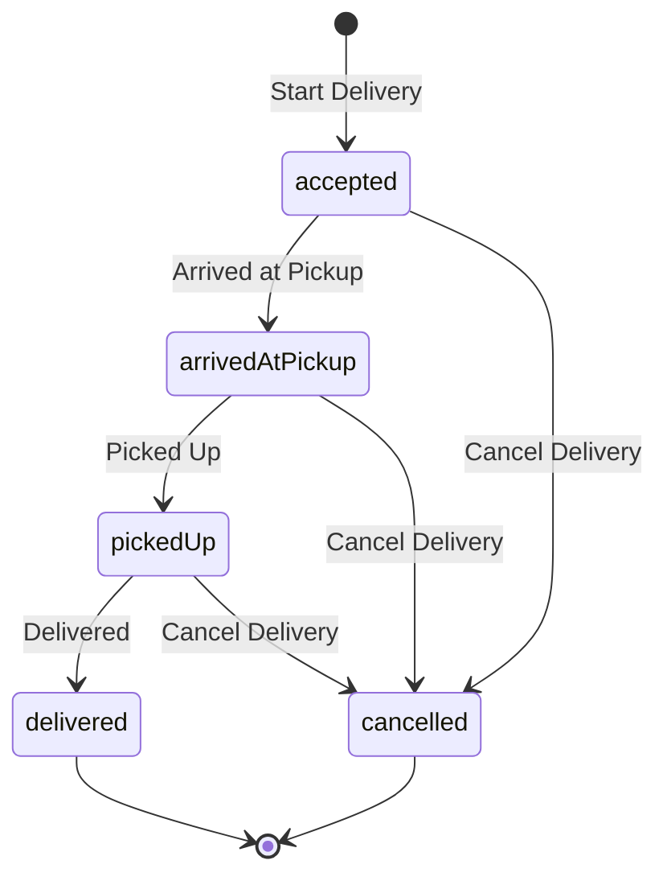

# Delivery lifecycle

A shift answers *when were you working*. A delivery answers *what were you doing inside it*. This
page describes what DashPilot records about a delivery, what it deliberately does not, and what
happens to a delivery that is still running when the app is closed.

!!! warning "Nothing here is detected"

    Every timestamp on a delivery exists because the driver tapped a control. DashPilot has no
    integration with DoorDash or any other delivery platform: it does not read an order, watch
    another app, scrape a screen, intercept traffic or infer a pickup from movement. A delivery the
    driver did not record is not in the app, and a state they did not tap is not claimed.

## The five states

| State | What it means | Recorded by |
| --- | --- | --- |
| `accepted` | The driver took the offer and is heading to the pickup | Creating the delivery |
| `arrivedAtPickup` | They reached the pickup and are waiting | `arrivedAtPickupAt` |
| `pickedUp` | The order is in the car | `pickedUpAt` |
| `delivered` | The delivery was completed. Terminal | `deliveredAt` |
| `cancelled` | It ended without being completed. Terminal | `cancelledAt` |

Acceptance is the delivery's creation rather than a separate optional timestamp. A delivery that
has not been accepted is a delivery that does not exist, so an optional `acceptedAt` would describe
a state the app can never be in.

## State is the timestamps

There is no stored `state` column and no `isPickedUp`-style flags. The state is derived from which
timestamps exist, so there is exactly one authoritative answer to what a delivery is doing, and it
is the same data that forms the historical record. A stored state could drift out of step with the
events it claims to summarise; a derived one cannot.

## Cancellation is history, not deletion

Real delivery work ends without a delivery: an order is cancelled, unassigned or returned.
Cancelling is available from every active state and keeps whatever genuinely happened first — a
delivery cancelled after twenty minutes at a pickup still records that the driver arrived there.

A cancelled delivery is never deleted, never counted as completed, and never folded into a single
total. It is work the driver did that did not end in a delivery.

## The rules, and where they live

These are enforced in `Delivery` and `DeliveryService` against the store, not by disabling a
button. A disabled control is presentation and cannot protect data.

- A delivery belongs to **exactly one shift** and can only begin while that shift is running.
- **At most one delivery is active at a time**, checked against the store rather than against view
  state.
- Transitions happen **in lifecycle order, once each**, and never after the delivery has finished.
  The service resolves the active delivery itself, so an out-of-order transition cannot even be
  expressed through the API.
- A timestamp that precedes the last recorded event is **clamped forward**, which is the rule
  `ShiftService` already applies to a shift end when the device clock moves backwards. A driver must
  always be able to record what just happened, and a clamped event produces a zero-length interval
  rather than a negative one.
- Deleting a shift deletes its deliveries, through the relationship's cascade rule.

## Ending a shift with a delivery running

**A shift cannot be ended while one of its deliveries is in progress.** The end is refused and the
driver is told to mark the delivery delivered or cancel it first.

The two alternatives were both dishonest. Marking the delivery delivered would record a completion
the driver never made; discarding it would erase a delivery they did make. Refusing costs one extra
tap and claims nothing.

## Relaunch recovery

The store is the only place delivery state lives, so recovery is not a code path. A delivery left
active when the app was terminated is still active on the next launch: the same delivery, its
original timestamps, and a control showing the *next* step of that delivery rather than an offer to
start a second one. Nothing synthesises a replacement, and no recovery step is asked of the driver.

## During a shift

The running shift shows one primary delivery control and nothing else to decide:

| Current state | The button says | VoiceOver hears |
| --- | --- | --- |
| No delivery active | Start Delivery | Start delivery |
| `accepted` | Arrived at Pickup | Mark arrived at pickup |
| `arrivedAtPickup` | Picked Up | Mark order picked up |
| `pickedUp` | Delivered | Mark delivery completed |

A second, bordered control cancels the delivery in progress, behind a confirmation that says the
delivery is kept as cancelled rather than deleted.

Deliberately absent: any field to type into. No restaurant, no customer, no address, no note and no
amount is asked for at any point, so a lifecycle event is one tap that can be made while stopped.
`End Shift` is bordered rather than prominent, because emphasising the once-a-shift, hard-to-undo
button over the one tapped many times a shift is how a shift gets ended by mistake.

## On a completed shift

The shift's detail screen lists what each delivery recorded: its outcome, the lifecycle events that
happened with their times, and the two intervals both of whose ends exist. It sits below the
earnings, route and performance sections, because it is the only one that grows with the shift.

| Derived interval | Definition | Shown when |
| --- | --- | --- |
| Waited at pickup | `pickedUpAt - arrivedAtPickupAt` | Both events were recorded |
| Accepted to delivered | `deliveredAt - acceptedAt` | The delivery was completed |

An interval with a missing end is left out rather than filled in with zero or with the shift's own
times. A cancelled delivery therefore shows the arrival it recorded and no wait, because the wait
never ended.

## What a delivery does not hold

- **No restaurant or business name.** Naming a pickup introduces typing while driving,
  normalisation, duplicate matching and a privacy question, none of which the lifecycle needs.
- **No customer, address or note.** DashPilot stores nothing that identifies who received an order.
- **No per-delivery earnings.** A shift's gross earnings are one number the driver typed for the
  whole shift, and DashPilot has no source from which to split it between deliveries. Inventing an
  allocation would produce a per-delivery figure nobody recorded.
- **No editing or deleting one delivery.** A recorded delivery is what happened. If mis-taps prove
  to be a real problem, correction is its own design decision rather than a general editing
  framework added speculatively.

## What is not built on this yet

Nothing. The lifecycle records events and derives two factual intervals for presentation. There is
no restaurant rating, no wait-time recommendation, no offer-profitability figure, no aggregate
across shifts and no prediction of any kind. See [Limitations](../reference/limitations.md).
