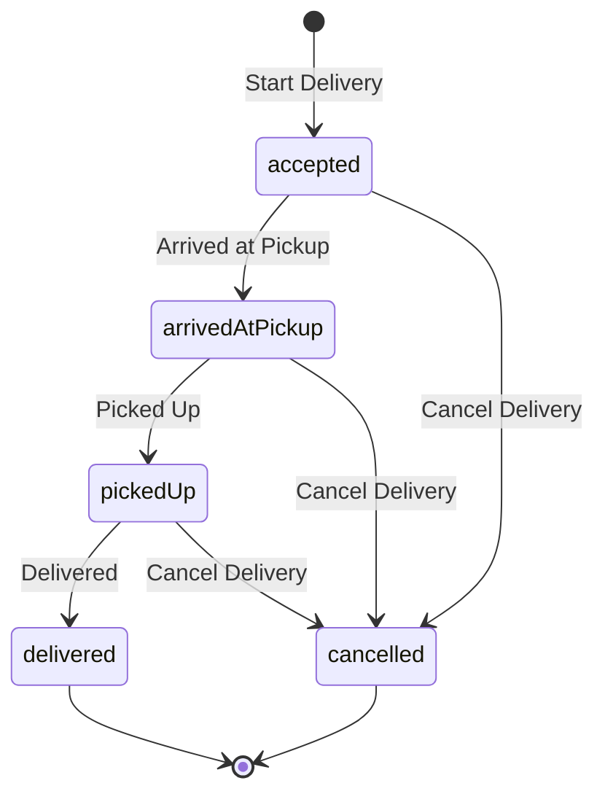

# Delivery lifecycle

A shift answers *when were you working*. A delivery answers *what were you doing inside it*. This
page describes what DashPilot records about a delivery, what it deliberately does not, how several
deliveries worked at once are kept apart, and what happens to a delivery that is still running when
the app is closed.

!!! warning "Nothing here is detected"

    Every timestamp on a delivery exists because the driver tapped a control. DashPilot has no
    integration with DoorDash or any other delivery platform: it does not read an order, watch
    another app, scrape a screen, intercept traffic or infer a pickup from movement. A delivery the
    driver did not record is not in the app, and a state they did not tap is not claimed.

## The five states

| State | What it means | Recorded by |
| --- | --- | --- |
| `accepted` | The driver took the offer and is heading to the pickup | Creating the delivery |
| `arrivedAtPickup` | They reached the pickup and are waiting | `arrivedAtPickupAt` |
| `pickedUp` | The order is in the car | `pickedUpAt` |
| `delivered` | The delivery was completed. Terminal | `deliveredAt` |
| `cancelled` | It ended without being completed. Terminal | `cancelledAt` |

Acceptance is the delivery's creation rather than a separate optional timestamp. A delivery that
has not been accepted is a delivery that does not exist, so an optional `acceptedAt` would describe
a state the app can never be in.

## State is the timestamps

There is no stored `state` column and no `isPickedUp`-style flags. The state is derived from which
timestamps exist, so there is exactly one authoritative answer to what a delivery is doing, and it
is the same data that forms the historical record. A stored state could drift out of step with the
events it claims to summarise; a derived one cannot.

## Cancellation is history, not deletion

Real delivery work ends without a delivery: an order is cancelled, unassigned or returned.
Cancelling is available from every active state and keeps whatever genuinely happened first — a
delivery cancelled after twenty minutes at a pickup still records that the driver arrived there.

A cancelled delivery is never deleted, never counted as completed, and never folded into a single
total. It is work the driver did that did not end in a delivery.

## The rules, and where they live

These are enforced in `Delivery` and `DeliveryService` against the store, not by disabling a
button. A disabled control is presentation and cannot protect data.

- A delivery belongs to **exactly one shift** and can only begin while that shift is running. A
  delivery is never moved to another shift.
- **Any number of deliveries may be active at once.** Starting one changes nothing about the
  others.
- Every lifecycle event is applied to **exactly one delivery, named by the caller**. Nothing infers
  which delivery a tap meant.
- A delivery can only be advanced while the shift it belongs to is still running.
- Transitions happen **in lifecycle order, once each**, and never after the delivery has finished.
- A timestamp that precedes the last recorded event is **clamped forward**, which is the rule
  `ShiftService` already applies to a shift end when the device clock moves backwards. A driver must
  always be able to record what just happened, and a clamped event produces a zero-length interval
  rather than a negative one.
- Deleting a shift deletes its deliveries, through the relationship's cascade rule.

## Offers and deliveries

One accepted **offer** can contain more than one **delivery**, and the two are different facts:

| | What it is | What it holds |
| --- | --- | --- |
| Offer | One acceptance event: the driver was shown work and took it | When it was accepted, and the deliveries it contained |
| Delivery | One customer dropoff | Its own pickup, its own terminal event, its own amounts |

Every delivery belongs to exactly one offer, and every offer holds at least one delivery. One tap on
`Start Delivery` records an offer of one, which is the ordinary case. A driver who accepted two
dropoffs together records one offer holding two.

**An add-on offer is a different offer.** Accepting more work while deliveries are already running is
ordinary, and it records a new offer every time. Two offers whose deliveries overlap in time are
still two acceptances, and nothing merges them: overlapping lifetimes are what stacked work looks
like, and treating them as one would erase the fact that the driver decided twice.

The shapes this covers, all of which are ordinary in real work:

- one offer, one store, one customer
- one offer, one store, two customers
- one offer, two stores, two customers
- one offer, two stores, one customer, as far as the existing lifecycle can express it: a delivery
  records **one** pickup, so two pickups are two deliveries, and a customer who received both is a
  fact DashPilot does not record about either
- one offer running, and a second accepted later
- several offers running at once, with their deliveries at different points

!!! info "An offer is a grouping the driver recorded"

    DashPilot reads no delivery platform, sees no offer screen and receives no notification. An
    offer here holds no platform identifier, no pay figure, no distance estimate and no customer: it
    exists because the driver said how many deliveries they had just accepted.

### Each delivery still advances on its own

Grouping changes nothing about the lifecycle. One delivery of an offer can be picked up while
another is still waiting at a counter, and completing one leaves its siblings exactly as they were.
An offer is complete only when **every** delivery in it is terminal.

**Cancellation is per delivery.** There is no control that cancels an offer. An offer whose
deliveries all ended cancelled is cancelled; one with a mix is partly completed, which is neither a
completed offer nor a cancelled one and is never reported as either.

### An offer holds no money and no time

Expected pay and recorded gross earnings stay on the delivery they were recorded against. Nothing
sums them into an offer total, nothing divides an amount between the deliveries of an offer, and no
rate, duration or distance is derived for an offer anywhere in the app. A sum over deliveries with no
amount recorded would read each of them as having paid nothing, which is the allocation this project
refuses everywhere else.

Delivery active time is unchanged: it unions the intervals of a shift's deliveries, so two that
overlap count their shared minutes once whether or not they share an offer.

### Recording one

`Start Delivery` is untouched: one tap, one delivery, in an offer of one. The same is true of the
App Shortcut and the Live Activity button, which both go through the same service call.

Beside it on the running shift is one small secondary control, `Offer With Several Deliveries`. It
opens a sheet that asks **a count and nothing else**: no pickup place, no amount, no customer and no
name, because each of those is optional on a delivery and can be added later from its own card. The
confirm button repeats the number it will record.

The stepper's range is a control's bounds rather than a rule. The model refuses an offer below one
delivery and caps nothing above it, since how much work a driver accepted is a fact about their work.

### Showing one

The running shift's cards are arranged by the offer they arrived in. An offer that held more than
one delivery gets a heading over its cards saying so, and how many of them are still in progress once
some have finished; an offer of one gets no heading at all, which is exactly what the screen looked
like before offers existed.

The heading is a **label and never a control**. Nothing acts on an offer as a unit: each card keeps
its own next step, its own pickup and expected-pay controls and its own named cancel button.

VoiceOver hears the grouping on every card rather than only in the heading, and it names the
siblings: *Part of Offer 1, accepted together with Delivery 2*. A listener has no layout to refer
back to, so the sentence has to say which other cards belong with this one. The completed-shift
history states the same thing on the rows of a grouped offer.

## Stacked deliveries

Delivery work is routinely stacked: a driver accepts a second order before the first is finished,
sometimes a third. **DashPilot supports any number of concurrent deliveries**, and each one advances
on its own.

Two deliveries are two records. They are never merged, never paired, and never summarised into a
single "stack" with one state — a shared state would have to answer "what is this stack doing" when
the honest answer is that one order is waiting at a counter and another is in the car.

Because several can be active, every lifecycle event names the delivery it belongs to. There is no
API and no control that resolves "the active delivery" and applies an event to whatever it finds,
because with two in progress there is no such thing, and picking one — the newest, the oldest,
whatever a fetch returned first — would attach a driver's tap to a record they did not mean.

!!! info "This is not a platform stack"

    DashPilot does not know that two orders were offered together, batched, or grouped by a delivery
    platform. It knows only what the driver recorded: two deliveries they started, and whether they
    said the two arrived in one offer. Nothing infers a relationship between them, and two deliveries
    accepted a second apart are two offers unless the driver said otherwise.

### Ordering and numbering

Deliveries are ordered by **acceptance time, earliest first**, with the record's identity breaking a
tie so that two accepted in the same instant cannot swap places between two reads. SwiftData's own
fetch order is never relied on.

The interface labels concurrent deliveries `Delivery 1`, `Delivery 2`, `Delivery 3`, numbered by that
order over the whole shift. This is **presentation only**:

- It is **not persisted**, and it is not a platform order number, a batch identifier, or anything
  anyone outside the app would recognise.
- It exists because two cards on screen have to be told apart, and it does that whether or not
  anything else is recorded. A [pickup place](pickup-identity.md) is optional and often absent, and an
  address or a platform order ID is data DashPilot does not collect at all.
- Numbering runs over every delivery in the shift, so finishing one does not renumber the others.
- Every control acts on the **persisted delivery**, not on its number or its row, so even a
  renumbering could not send an event to the wrong record.

## Ending a shift with deliveries running

**A shift cannot be ended while any of its deliveries are in progress.** The end is refused and the
driver is told to mark each one delivered or cancel it; the refusal counts them ("2 deliveries are
still in progress"). Finishing one of three does not unblock the shift — the other two still
happened.

The alternatives were all dishonest. Marking them delivered would record completions the driver
never made; discarding them would erase deliveries they did make. Nothing is auto-completed,
auto-cancelled or deleted.

## By voice

Starting a delivery, and recording its next event, can also be asked for without the screen. The
event recorded is whichever one `nextAction` says comes next, and the confirmation names it.

**A spoken step is recorded only while exactly one delivery is in progress.** With two, the request
names neither, so nothing is recorded and the refusal says how many are running and where to record
it. `Start Delivery` is unaffected: it creates a delivery rather than naming one. See
[Voice and system actions](voice-actions.md).

## Relaunch recovery

The store is the only place delivery state lives, so recovery is not a code path. **Every** delivery
left active when the app was terminated is still active on the next launch: the same records, their
original timestamps, each with its own next step. None is collapsed into another, none is duplicated,
and none is picked as the authoritative one. Nothing synthesises a replacement, and no recovery step
is asked of the driver.

## During a shift

The running shift shows one card per delivery being worked. Each card names its delivery, says what
that delivery is doing, and offers exactly one lifecycle action — its own next step:

| That delivery's state | Its button says | VoiceOver hears |
| --- | --- | --- |
| `accepted` | Arrived at Pickup | Delivery 1. Mark arrived at pickup |
| `arrivedAtPickup` | Picked Up | Delivery 1. Mark order picked up |
| `pickedUp` | Delivered | Delivery 1. Mark delivery completed |

So a driver holding one order waiting at a counter and another already in the car sees
`Arrived at Pickup` on one card and `Delivered` on the other. Neither the lifecycle step nor the
delivery it applies to is ever chosen from a menu.

`Start Delivery` sits below the cards and is available the whole time the shift runs, because
accepting another order is ordinary work rather than an exception. It is the prominent control only
when nothing is in progress; while deliveries are running, the prominent controls are the ones
advancing them.

Each card also carries a bordered `Cancel Delivery 2` control — named, never a global "Cancel
Delivery" that picks its own target — behind a confirmation that repeats which delivery it will end
and says the delivery is kept as cancelled rather than deleted.

Deliberately absent from the running shift itself: any field to type into. No customer, no address,
no note and no amount is asked for at any point, so a lifecycle event is one tap that can be made
while stopped. Recording what a delivery paid is offered only afterwards, from a completed shift's
history, and the model refuses an amount on a delivery that is still in progress. The card's one secondary control — `Add Pickup Place` — opens a
[sheet](pickup-identity.md#recording-one) rather than putting a keyboard beside the lifecycle
buttons, and it can be answered in one tap from a recent place or ignored entirely.

`End Shift` is bordered rather than prominent, because emphasising the once-a-shift, hard-to-undo
button over the ones tapped many times a shift is how a shift gets ended by mistake.

## On a completed shift

The shift's detail screen lists what each delivery recorded: its outcome, the
[pickup place](pickup-identity.md) if one was named, the lifecycle events that happened with their
times, the two intervals both of whose ends exist, and the
[amount](earnings-and-metrics.md#per-delivery-gross-earnings) if one was recorded. Deliveries appear in
acceptance order, under the same numbers they had on the running shift. It sits below the earnings,
route and performance sections, because it is the only one that grows with the shift.

| Derived interval | Definition | Shown when |
| --- | --- | --- |
| Waited at pickup | `pickedUpAt - arrivedAtPickupAt` | Both events were recorded |
| Accepted to delivered | `deliveredAt - acceptedAt` | The delivery was completed |

An interval with a missing end is left out rather than filled in with zero or with the shift's own
times. A cancelled delivery therefore shows the arrival it recorded and no wait, because the wait
never ended.

`Waited at pickup` is a fact about **this delivery**, not a claim about the place. The same interval
is what a pickup place's recorded history is built from, under the same inclusion rule — see
[Pickup wait](pickup-wait.md).

**Deliveries worked at the same time show overlapping times, and that is not a fault in the
record.** Each delivery's intervals are its own, measured between its own timestamps, and nothing
adds two of them together.

### Delivery active time

The shift section states how much of the shift at least one delivery was active for, and how much of
it was not:

| Duration | Definition |
| --- | --- |
| Delivery active time | The **union** of every delivery's `acceptedAt` to terminal-event interval |
| Non-delivery time | Elapsed shift time less delivery active time, clamped at zero |

A delivery active for 30 minutes and another active for 25, overlapping by 20, is **35 minutes** of
delivery active time — not the 55 their durations sum to. The overlapping minutes are counted once,
because a driver cannot be in two places at once and summing them would let active time exceed the
shift it happened in. A cancelled delivery contributes from acceptance until it was cancelled.

Non-delivery time is **not idle time**: it holds waiting for an offer, repositioning, breaks and any
work that was not recorded. Neither duration says anything about what the driver was doing, and
neither is presented as work, driving or productive time. The full definitions, and the gross
earnings per active delivery hour derived from them, are on
[Earnings and metrics](earnings-and-metrics.md#delivery-active-time).

### Gross earnings

Each finished delivery may carry one optional amount the driver typed for it, and a delivered one
that carries an amount also shows `gross earnings ÷ its own accepted-to-delivered interval` — *gross
per recorded delivery hour*. Both are absent when nothing was recorded, and neither is ever
substituted with zero.

That rate covers **one delivery's own lifecycle**. Because stacked lifecycles overlap, these figures
are never summed, averaged or compared across a shift; the figure that spans deliveries is the
shift's delivery active time above. A cancelled delivery may hold an amount and never gets an hourly
figure — there is no cancelled hourly rate in DashPilot.

The shift's own amount and a delivery's amount are **independent facts**. Nothing splits one into
the other, adds one up from the other, or reports a difference between them as a problem. The full
rules are on [Earnings and metrics](earnings-and-metrics.md#per-delivery-gross-earnings).

### Expected pay

A delivery **still in progress** may also carry what the driver expects it to pay. It is entered
from a small secondary control on the delivery's card, in the same place and the same shape as the
pickup-place control, because the moment the figure is available is while the driver is standing
still at a pickup and the moment it is gone is that evening.

**It is not earnings**, and DashPilot keeps the two apart everywhere:

- It is stored in its own column, and only ever set while the delivery is active. Once a delivery is
  delivered or cancelled the app refuses a new expected amount, because the fact worth recording
  then is what it paid.
- No total, rate, period figure, export summary or comparison anywhere in the app is derived from
  it. A delivery with an expected amount and no recorded amount has earned nothing DashPilot knows
  about.
- The distinction holds even when the two numbers are identical. Nothing turns one into the other.
- It is labelled *expected pay* wherever it is printed and is spoken with a sentence saying it is
  not what was recorded, because a listener has no column heading to read that from.

**Marking a delivery delivered records no earnings by itself.** A delivery that carries an expected
amount raises a confirmation once it is delivered: the expected figure is stated, the amount to
record starts from it, and the driver either records what the delivery actually paid or dismisses
the sheet. Dismissing leaves the delivery with the expectation it had and no gross earnings, and the
completed shift's history offers the same confirmation again. A delivery with no expected amount
raises nothing, so the flow is unchanged for a driver who does not use this.

Expected pay is in the JSON export, on the delivery that carries it and nowhere else. It is
deliberately **not** in the CSV export: see
[History export](history-export.md) for that decision.

### Pickup place

A delivery may optionally name the place it was collected from. It is typed by the driver, entirely
optional, and reused across deliveries when the same name is entered again — the local number and the
place are shown together, `Delivery 1` above `Nowhere Noodles`. Nothing about the lifecycle depends
on it, and a delivery with no place named is a complete, ordinary delivery.

The rules, the normalisation policy and what a place deliberately does not hold are on
[Pickup identity](pickup-identity.md).

## What a delivery does not hold

- **No customer, address or note.** DashPilot stores nothing that identifies who received an order,
  and a [pickup place](pickup-identity.md) is a name the driver typed rather than a located business.
- **No amount DashPilot worked out for itself.** A delivery holds an amount only if the driver typed
  one against that delivery. A shift's gross earnings are a separate number they typed for the whole
  shift, and DashPilot has no source from which to split it between deliveries — inventing an
  allocation would produce a per-delivery figure nobody recorded.
- **No per-delivery mileage.** Route distance is measured for a shift, never assigned to one
  delivery, so there is no per-delivery cost or gross-per-mile figure.
- **No editing or deleting one delivery.** A recorded delivery is what happened. If mis-taps prove
  to be a real problem, correction is its own design decision rather than a general editing
  framework added speculatively.
- **No inferred relationship between concurrent deliveries.** Two deliveries active at once are two
  independent records. They are shown as one group only when the driver said they were accepted
  together, and nothing pairs them by their timing, their pickup place or their overlap.

## What is not built on this yet

The lifecycle records events, derives two factual intervals per delivery, unions those intervals into
a shift's delivery active time and the one rate over it, lets a delivery name where it was picked up
and carry an amount the driver typed for it, and summarises the waits recorded at each such place as
a median with its sample count — see [Pickup wait](pickup-wait.md). Beyond that, nothing: no
restaurant rating or ranking, no merchant profitability, no offer-profitability figure, no
per-delivery mileage, no aggregate across shifts, no analysis of *why* deliveries overlapped, and no
prediction of any kind.
See [Limitations](../reference/limitations.md).

## Schema

The store has held `Delivery` as its own entity with a to-many `Shift.deliveries` relationship since
[version 5](../architecture/migrations.md), and an optional per-delivery amount since version 7.

Neither concurrent deliveries nor delivery active time changed that shape. Version 5 could always
describe several unfinished deliveries for one shift — "at most one active delivery" was an
application invariant enforced by a service, not a constraint the database imposed — so removing it
changed behaviour and nothing about storage. Active time is derived from the timestamps already
stored, every time it is shown; no `activeDuration`, `nonDeliveryDuration` or `activeHourlyRate`
column exists, for the reason no mileage or rate column does.

[Version 6](pickup-identity.md#schema) added the optional pickup place, as a new entity and a new
optional reference. Existing deliveries migrated with none.

[Version 12](../architecture/migrations.md#v11-to-v12) added the `Offer` entity and an optional
`Delivery.offer` reference, and is the first stage in the app's history that is **custom** rather
than lightweight. Every delivery recorded before it is given its own one-delivery offer, taking that
delivery's own acceptance timestamp, and no two historical deliveries are ever grouped together: a
v11 store holds no evidence that any two arrived in one acceptance, and deliveries accepted a second
apart are exactly what tapping Start Delivery twice produces. `Delivery.shift` is unchanged, so no
figure, fetch or delete rule moved.
