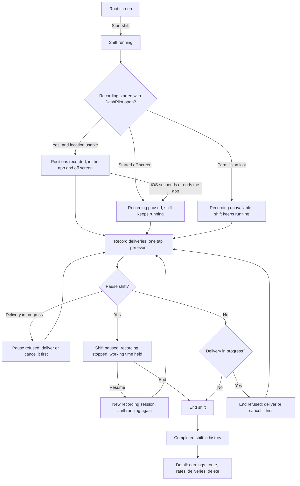

# Shift workflow

A shift is the unit everything else attaches to. This page follows one from the driver's side; the
implementation is described under [Architecture](../architecture/overview.md).



## Starting a shift

The root screen offers a start control while no shift is running. Starting records a start
timestamp and nothing else. At most one shift may be unfinished at a time, and the rule is checked
against the store, so the absence of the button is presentation and not the protection.

A shift can also be started by voice, without opening the app: see
[Voice and system actions](voice-actions.md). The rule is the same either way, because the same
service enforces it, and the spoken confirmation states that recording begins when the app is
opened.

Starting a shift also puts one Live Activity on the Lock Screen, which is where the rest of the shift
can be watched and controlled without unlocking the phone. See
[The shift on the Lock Screen](live-activity.md).

If the app is terminated while a shift is running, the next launch finds the same unfinished shift
and resumes it with its original start time. Nothing synthesises a replacement shift, and no
recovery step is asked of the driver.

## While a shift runs

The running shift shows a working timer derived from the recorded timestamps, and one line
describing route capture:

| State | What it means |
| --- | --- |
| Location tracking active | Positions are being recorded, and go on being recorded in another app or behind a locked screen |
| Route recording stopped | The driver paused the shift, so nothing is being recorded until they resume |
| Route recording paused | The shift began with DashPilot off screen, so there is nothing recording yet |
| Permission required | Location permission has not been granted, so nothing is being recorded |
| Unavailable | Location Services is off, access is restricted, or the store refused a write |

The active line carries a sentence of its own rather than a green label and silence. Recording
continuing off screen is the useful half; that iOS can still stop it, and that it does not restart
on its own once DashPilot is closed, is the half a driver has to know before trusting the total.

Losing location never ends a shift. Capture becomes unavailable, the shift keeps running, and the
driver decides when it ends.

The timer counts **working** time, which is the whole shift less the stretches the driver paused it.
For a shift that was never paused that is the same figure the timer always showed. It is the number
every rate the shift produces divides by, so the figure watched during the shift and the figure read
afterwards are the same one.

Under it the shift reports what it has recorded so far:

```text
02:14:07
Worked so far
4.5 mi recorded · partial route
2 capture segments · 1 capture gap
2 deliveries in progress · 3 completed
```

The mileage is **recorded** mileage, in the same words and from the same calculation the finished
shift uses, and it grows only while positions are being accepted. A pause stops it, and resuming
never adds the distance covered during the break. The segment and gap counts under it are what make
the partiality concrete without a paragraph a driver in a cradle would not read; the sentence that
explains what a partial route means is on the finished shift's own screen.

**No earnings and no rates appear on a running shift**, and the screen says why rather than showing
a dash or a zero. A shift's gross earnings cannot be recorded until it has finished, so every rate
derived from them is withheld: `This shift is still running. Rates are worked out once it ends.`
Nothing is worked out from the amounts recorded against individual deliveries, which are a separate
fact and never a shift total.

Still deliberately absent: a map, coordinates, a sample count, an earnings projection, a target, a
goal and any comparison with another shift.

## Pausing a shift

A driver who stops for a meal, an errand or the end of a busy block can **pause** the shift instead
of ending it. Pausing is a real recorded state rather than something the screen remembers: it is a
row with a start timestamp, it survives the app being terminated, and the shift stays the unfinished
shift throughout.

Three things happen, and nothing else:

- **Working time stops accumulating.** The timer holds at whatever it read, and the paused stretch
  is excluded from the shift's working duration and from every hourly figure derived from it. The
  shift's elapsed duration still covers the whole span, and both are shown on the finished shift.
- **Route recording stops immediately.** Nothing is recorded for as long as the shift is paused.
- **Deliveries cannot be started.** The delivery control is replaced by the reason.

**Pausing is refused while a delivery is in progress**, with a message naming how many. Pausing says
the driver stopped working and an open delivery says they had not, and a shift holding both would
report delivery active time running through hours it also reports as not worked.

Resuming closes the pause and starts a **new** recording session. The distance between where the
driver paused and where they resumed is never counted: nothing was recorded across that stretch, so
nothing is measured across it. The shift's route carries the break, and the mileage is a floor as it
always is.

Pause and Resume can also be spoken, without opening the app, and both are on the shift's Lock Screen
card: see [Voice and system actions](voice-actions.md) and
[The shift on the Lock Screen](live-activity.md). A shift resumed by either records no route until
DashPilot is opened, for the same reason a shift started by voice does not, and the spoken
confirmation says so.

A shift left paused when the app is terminated is still paused on the next launch, with its pause
intact and nothing recording.

## Correcting a recorded pause

A pause is two taps made at a kerb, and it is the easiest thing in DashPilot to record at the wrong
moment: pausing on arriving at a restaurant rather than on leaving it, forgetting to resume until
the next offer arrives, or forgetting to pause at all. Until the pauses of a **finished** shift
became correctable, the only remedy was deleting the whole shift, which threw away its route, its
deliveries and its amounts to fix one timestamp.

The corrections live on the finished shift's own detail screen, in a `Pauses` section beside the
paused and working figures they feed:

| Correction | What it records |
| --- | --- |
| Edit Pause | This pause began, ended, or both, at times other than the ones recorded |
| Delete Pause | This pause was recorded by mistake and did not happen |
| Add Missed Pause | A pause was taken and never recorded |

Each opens two date and time pickers with the shift's own start and end as their bounds. Nothing is
written while the pickers move, **Cancel leaves the pause exactly as it was**, and the screen states
what the shift's working time would become before anything is saved.

### What a correction is refused for

A stretch is **named and refused**, never quietly clamped, swapped or nudged into the nearest
acceptable one:

- it has to end after it starts, so a pause of no length or of negative length is refused; deleting
  a pause is the separate action for a pause that should not exist
- both times have to be inside the shift
- it may not overlap another pause the shift records, because two pauses covering the same minutes
  are one pause recorded twice, and combining them would delete a row the driver can still see
- it may not overlap a stretch a delivery was open for, which is the same fact the live lifecycle
  already keeps from both directions, and it is refused rather than resolved by moving the delivery

Two pauses may **touch**: one beginning exactly where another ended is two adjacent breaks, not one
claim made twice.

### What a correction never touches

- **The shift's own start and end times.** Its elapsed duration is the same afterwards.
- **The route.** No recorded position is added, moved, deleted or reassigned to another capture
  session, so the recorded mileage, the capture segments and the gaps are all exactly as they were.
  A pause recorded live left a real break in the route and that break stays.
- **Deliveries.** No lifecycle timestamp moves, so the shift's delivery active time does not either.
- **Amounts.** The shift's gross earnings and every delivery's stay as entered.

What does move is what a pause is subtracted from: the shift's paused time, its working duration,
its gross per shift hour, and the period totals and rates that sum working durations.

!!! note "A pause added afterwards does not rewrite the route"

    A pause recorded during the shift stopped recording, so the route has a real gap across it. A
    pause **added** afterwards does not: DashPilot never deletes positions it recorded, so a shift
    can record mileage inside a stretch it also records as paused. The alternatives were both
    dishonest, and the detail screen's route section says so rather than smoothing it over.

### What is not correctable here

**The open pause of a shift that is paused right now.** It is ended by resuming or by ending the
shift, both of which reconcile route capture and the Lock Screen card as they close it, and this
editor does neither. The same rule is why none of these corrections appear on a running shift at
all: choosing two times from two pickers is the sustained attention DashPilot keeps away from a
driver who may be at a wheel.

**Nothing is detected.** No pause is inferred from a stationary stretch, a gap in the route or a
quiet hour, and none is proposed when one is added. Every timestamp here was typed by the driver.

## Location permission

Permission is never requested at launch. iOS shows the prompt once, and a prompt that appears
before the driver has any reason to grant it is the surest way to have it declined permanently, so
the request is always a tap.

DashPilot asks for **When In Use** only. That is not a restriction it works around: paired with the
location background mode, it is exactly what lets recording started with the app open carry on while
the driver is elsewhere. Always would buy starting a recording from the background and being
relaunched into one, and DashPilot does neither.

The authorization panel states the current condition and offers only a recovery that
actually works: the prompt when permission has not been decided, the app's Settings page when it
was denied, a description of where the Location Services switch lives when the system-wide switch
is off, and nothing at all when access is restricted or already granted.

## Recording deliveries

A running shift offers one primary delivery control, and what it says depends on what the driver has
already recorded: `Start Delivery`, then `Arrived at Pickup`, `Picked Up` and `Delivered`. Nothing
is typed and nothing is detected. The full lifecycle, its rules and its limits are on
[Delivery lifecycle](delivery-lifecycle.md).

## Ending a shift

**A shift cannot be ended while one of its deliveries is in progress.** The end is refused with a
message saying to mark the delivery delivered or cancel it first — silently completing it would
record a delivery the driver never made, and silently discarding it would erase one they did.

**A paused shift can be ended without resuming it first.** The pause is closed at the same instant
the shift ends, which is the truthful reading of what happened: the driver was paused right up to
the moment they stopped. Its full length therefore stays out of the working duration, and a shift
paused and then ended can have a working duration well short of its elapsed one. Refusing would make
a driver who has finished resume a shift they are not working in order to end it, which would record
work that did not happen.

Ending records an end timestamp. Capture is stopped and any pending positions are written before
the end is recorded, so no position is judged against a shift the store has already closed. If
ending fails, capture restarts rather than staying off.

If the device clock has moved behind the recorded start, the end is clamped to the start, and to an
open pause's start if there is one. Recording a zero-length shift or a zero-length pause is
preferable to leaving a driver unable to end their shift until the clock catches up.

## History

Completed shifts appear in a list, each row a compact summary and a single tap target:

```text
Sat, Aug 23                              $86.25
5:46 PM - 8:46 PM · 3 hr
4.5 mi recorded · partial route · $28.75/hr
```

The duration on the second line is the **working** time, so it multiplies out against the rate on
the third. A shift that was paused says so on the same line (`· 1 pause`), and the shorter figure is
then not read as a mistake.

Three lines, no controls. Only figures that exist appear: an unavailable rate leaves nothing behind,
no dash and no `$0.00`. At accessibility text sizes the date and the amount stack rather than share
a line, and the summary wraps rather than truncating, because the first thing a truncation takes is
the end of "recorded", which is the word that makes the mileage honest.

## Shift detail

Tapping a row opens a screen for that shift alone. The row answers *what shift is this and roughly
how did it go*; the detail screen answers *what exactly happened* and *how trustworthy are these
numbers*.

| Section | What it holds |
| --- | --- |
| Shift | Start time, end time, elapsed duration, and, for a shift that was paused, its paused and working durations |
| Earnings | The recorded amount or "No amount recorded", and Add or Edit Earnings |
| Route | Recorded mileage, capture segments, capture gaps, and what qualifies them |
| Performance | Both derived rates, or the reason each could not be derived |
| Pauses | Each recorded pause with its times and length, Edit and Delete for each, and Add Missed Pause |
| Deliveries | How many were completed and cancelled, and what each one recorded |
| Delete | Delete Shift, behind a confirmation |

The pause list and the delivery log are the last two reading sections because they are the two that
grow with the shift; the four above them summarise it in a fixed number of lines.

It is a summary, not a dashboard: no chart, no map, no gauge and no score. Only completed shifts
have a detail screen, because a running shift has no finalised duration, no earnings it may record
and nothing that may be deleted.

## Entering earnings

Earnings are entered from the detail screen, in a sheet with a field, Cancel and Save. Editing is a
draft: the typed text is view state and the store is written once, on Save or Remove. Cancel leaves
the recorded amount exactly as it was, and a refused amount keeps the sheet open with what was
typed and says which rule it broke.

Removing an amount is its own action rather than an empty field, because an empty field would
ambiguously mean both "invalid" and "delete". No amount recorded and an amount of zero are
different facts everywhere in the app.

A running shift offers nothing to type into. Typing is a task for a parked car, and the model
refuses an amount on an unfinished shift as well, because a screen that is merely never presented
is not a rule.

## Deleting a shift

Deletion is offered on the detail screen, behind an alert that names what it destroys, including
the number of route positions that go with the shift. That count is the part a driver is least
likely to have in mind and cannot re-enter by hand.

!!! danger "Deletion is permanent"

    A deleted shift is removed from the device's store together with its route positions, its
    recorded pauses and its recorded amount. There is no undo, no trash, no archive and no copy anywhere else. A shift that
    is still running cannot be deleted at all.
