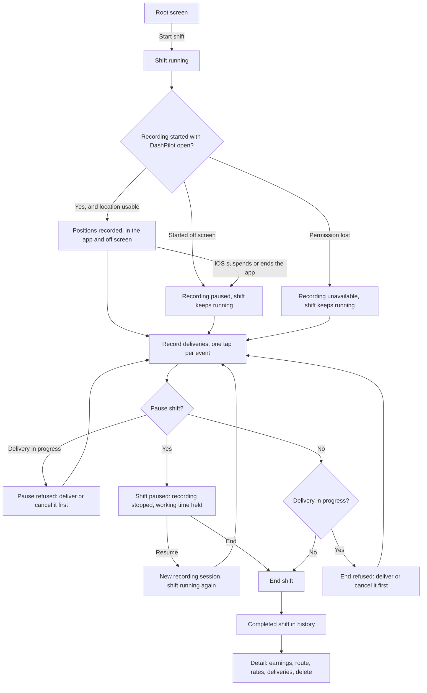

# Shift workflow

A shift is the unit everything else attaches to. This page follows one from the driver's side; the
implementation is described under [Architecture](../architecture/overview.md).



## Starting a shift

The root screen offers a start control while no shift is running. Starting records a start
timestamp and copies the driver's current vehicle and gas price onto the new shift, which owns that
copy from then on (see [Settings and vehicles](settings.md)). At most one shift may be unfinished at a
time, and the rule is checked against the store, so the absence of the button is presentation and not
the protection.

### Which vehicle the next shift will record

Above `Start Shift`, one short line says which vehicle the shift about to be started will record,
with its miles per gallon and the current gas price under it where those are set: `2020 Honda Civic`,
then `34 MPG · Gas $3.29/gal`. A driver with two vehicles can see before the tap whether they forgot
to switch.

It is read through the same rule the start copies from, so what it says is what the shift records.
Changing the selected vehicle in Settings and coming back changes it, because no shift exists yet.
Once the shift starts, this line is gone and the running shift's own line takes its place, read from
the shift's snapshot (see [Which vehicle the shift is using](#which-vehicle-the-shift-is-using)).

Nothing selected reads `No vehicle selected`. A missing figure is left out rather than written as
`0 MPG` or `$0.00`, no vehicle is chosen on the driver's behalf, and **none of this refuses a start**:
a shift started with nothing to copy records no assumptions. Looking at the line writes nothing.

VoiceOver reads it as a separate element from the button: `Next shift vehicle, 2020 Honda Civic, 34
miles per gallon, gas $3.29 per gallon`, or `No vehicle selected for the next shift`. It wraps at large
text sizes rather than truncating the vehicle's name.

A shift can also be started by voice, without opening the app: see
[Voice and system actions](voice-actions.md). The rule is the same either way, because the same
service enforces it, and the spoken confirmation states that recording begins when the app is
opened.

Starting a shift also puts one Live Activity on the Lock Screen, which is where the rest of the shift
can be watched and controlled without unlocking the phone. See
[The shift on the Lock Screen](live-activity.md).

If the app is terminated while a shift is running, the next launch finds the same unfinished shift
and resumes it with its original start time. Nothing synthesises a replacement shift, and no
recovery step is asked of the driver.

## While a shift runs

The running shift shows a working timer derived from the recorded timestamps, and one line
describing route capture:

| State | What it means |
| --- | --- |
| Location tracking active | Positions are being recorded, and go on being recorded in another app or behind a locked screen |
| Route recording stopped | The driver paused the shift, so nothing is being recorded until they resume |
| Route recording paused | The shift began with DashPilot off screen, so there is nothing recording yet |
| Permission required | Location permission has not been granted, so nothing is being recorded |
| Unavailable | Location Services is off, access is restricted, or the store refused a write |

The active line carries a sentence of its own rather than a green label and silence. Recording
continuing off screen is the useful half; that iOS can still stop it, and that it does not restart
on its own once DashPilot is closed, is the half a driver has to know before trusting the total.

Losing location never ends a shift. Capture becomes unavailable, the shift keeps running, and the
driver decides when it ends.

The timer counts **working** time, which is the whole shift less the stretches the driver paused it.
For a shift that was never paused that is the same figure the timer always showed. It is the number
every rate the shift produces divides by, so the figure watched during the shift and the figure read
afterwards are the same one.

Under it the shift reports what it has recorded so far:

```text
02:14:07
Worked so far
4.5 mi recorded · partial route
2 capture segments · 1 capture gap
2 deliveries in progress · 3 completed
2020 Honda Civic
34 MPG
```

The mileage is **recorded** mileage, in the same words and from the same calculation the finished
shift uses, and it grows only while positions are being accepted. A pause stops it, and resuming
never adds the distance covered during the break. The segment and gap counts under it are what make
the partiality concrete without a paragraph a driver in a cradle would not read; the sentence that
explains what a partial route means is on the finished shift's own screen.

**No earnings and no rates appear on a running shift**, and the screen says why rather than showing
a dash or a zero. A shift's gross earnings cannot be recorded until it has finished, so every rate
derived from them is withheld: `This shift is still running. Rates are worked out once it ends.`
Nothing is worked out from the amounts recorded against individual deliveries, which are a separate
fact and never a shift total.

Still deliberately absent: a map, coordinates, a sample count, an earnings projection, a target, a
goal and any comparison with another shift.

### Which vehicle the shift is using

The last two lines are the vehicle assumptions **this shift recorded when it started**, so a driver
with two vehicles who forgot to switch can see it without leaving the screen. It answers *which
vehicle is this shift using?*; Settings answers a different question, which is what the **next** shift
will record.

It reads the shift's own snapshot and nothing else. Changing the selected vehicle, renaming a
profile, correcting its miles per gallon, deleting it or changing the current gas price all leave
this row exactly where it is. A shift that recorded nothing says `No vehicle recorded` rather than
borrowing what is selected today, which would claim the shift was worked in a vehicle nobody
recorded.

The gas price is deliberately not here. It is an input to the fuel estimate a finished shift reports,
and the one screen a driver reads while working is not where a price belongs. See
[Estimated fuel and net](estimated-fuel.md) and [Settings and vehicles](settings.md).

### Correcting the vehicle, before any driving is recorded

Beside the vehicle lines there is a small `Change`, and it is offered **only while the shift's route
has recorded no distance**. A driver who notices at the kerb that they started the shift in the wrong
vehicle, or under a gas price they have since seen is wrong, can correct this shift's own snapshot
there and then.

The sheet is two explicit choices, each defaulting to keeping what the shift already recorded: which
vehicle, and whether to take the gas price currently in Settings. Nothing is written until Save, and
Save is unavailable until something differs from what is recorded. Choosing a vehicle **copies** its
current name and miles per gallon onto this shift: nothing in Settings is changed, the selection is
not moved, and renaming or deleting that vehicle afterwards leaves this shift saying what it
recorded.

**Once the route has measured a distance the control is gone**, and the vehicle lines stay readable
without it. Changing what a mile is assumed to cost after the miles are recorded would restate what
those miles are estimated to have consumed, with nothing to point at, so the correction closes rather
than being offered and refused. The rule is measured distance and never elapsed time: a driver who
has been sitting still for an hour can still correct, and one who has driven ten miles in five
minutes cannot.

The remedy after that is the finished shift's own fuel editor, on its detail screen. Correcting the
assumptions of shifts already recorded is not a feature DashPilot has.

## Pausing a shift

A driver who stops for a meal, an errand or the end of a busy block can **pause** the shift instead
of ending it. Pausing is a real recorded state rather than something the screen remembers: it is a
row with a start timestamp, it survives the app being terminated, and the shift stays the unfinished
shift throughout.

Three things happen, and nothing else:

- **Working time stops accumulating.** The timer holds at whatever it read, and the paused stretch
  is excluded from the shift's working duration and from every hourly figure derived from it. The
  shift's elapsed duration still covers the whole span, and both are shown on the finished shift.
- **Route recording stops immediately.** Nothing is recorded for as long as the shift is paused.
- **Deliveries cannot be started.** The delivery control is replaced by the reason.

**Pausing is refused while a delivery is in progress**, with a message naming how many. Pausing says
the driver stopped working and an open delivery says they had not, and a shift holding both would
report delivery active time running through hours it also reports as not worked.

Resuming closes the pause and starts a **new** recording session. The distance between where the
driver paused and where they resumed is never counted: nothing was recorded across that stretch, so
nothing is measured across it. The shift's route carries the break, and the mileage is a floor as it
always is.

Pause and Resume can also be spoken, without opening the app, and both are on the shift's Lock Screen
card: see [Voice and system actions](voice-actions.md) and
[The shift on the Lock Screen](live-activity.md). A shift resumed by either records no route until
DashPilot is opened, for the same reason a shift started by voice does not, and the spoken
confirmation says so.

A shift left paused when the app is terminated is still paused on the next launch, with its pause
intact and nothing recording.

## Parking for a pickup

A driver who parks and walks into a shop to collect an order can record the vehicle as **parked**.
It exists because walking around a shop inflates a recorded route, and DashPilot has no way to tell a
walk from a drive: a stored position carries no speed, and the rule that keeps a route free of noise
treats a walk across a car park exactly as it treats a crawl through traffic. Rather than guess, the
app lets the driver say it and records that they said it.

Like a pause, it is a row with a start timestamp rather than something the screen remembers, so a
shift left parked when the app is terminated comes back parked with nothing to recover.

**Unlike a pause, it subtracts nothing.** Shopping is working:

| | Pause | Parked |
| --- | --- | --- |
| Working time | Stops accumulating | Keeps counting |
| Hourly rates | Divide by less | Unchanged |
| Deliveries | Cannot be started, none may be open | Unaffected, any number may be open |
| Route recording | Stops | Stops |

The one consequence is to the route. Recording stops, so the walk is never written down; driving
again starts a **new** recording session, so the distance between where the vehicle was parked and
where it is driven off from is never counted. See
[Parked for a pickup](recorded-mileage.md#parked-for-a-pickup).

**Parking is refused while the shift is paused.** Pausing says the driver stopped working and
parking says they are working on foot, and a shift holding both would be claiming two things about
the same minutes. Resuming the shift first is one tap.

**It belongs to the shift, never to a delivery.** Whether the vehicle is moving is a fact about the
driver and their vehicle: a driver shopping for one order while carrying another has one vehicle and
it is parked. So there is one stretch at a time however many deliveries are open, no delivery starts
or ends one, and nothing about [stacked deliveries](delivery-lifecycle.md#stacked-deliveries) divides
it.

Leaving the state is always explicit. `Resume Driving` is one tap, pausing the shift closes it, and
ending the shift closes it at the end instant. Nothing resumes because a speed changed, because a
position moved or because a delivery advanced.

The running shift and the shift's Lock Screen card both say `Parked` for as long as the state lasts,
and both say plainly that the shift is still running, because forgetting to leave the state is the
expensive way this goes wrong.

**Both halves can be recorded without opening the app.** `Park my vehicle in DashPilot` and `Resume
driving in DashPilot` are App Shortcuts, and the shift's Lock Screen card offers the matching button:
whichever of the pair applies, never both. A driver with two bags in their hands cannot unlock a
phone, and a state nobody can enter or leave hands-free is a state that gets forgotten. Every rule
above applies to all three ways of saying it, because all three call the same two service operations.
See [Voice and system actions](voice-actions.md) and
[The shift on the Lock Screen](live-activity.md).

## Correcting a recorded pause

A pause is two taps made at a kerb, and it is the easiest thing in DashPilot to record at the wrong
moment: pausing on arriving at a restaurant rather than on leaving it, forgetting to resume until
the next offer arrives, or forgetting to pause at all. Until the pauses of a **finished** shift
became correctable, the only remedy was deleting the whole shift, which threw away its route, its
deliveries and its amounts to fix one timestamp.

The corrections live on the finished shift's own detail screen, in a `Pauses` section beside the
paused and working figures they feed:

| Correction | What it records |
| --- | --- |
| Edit Pause | This pause began, ended, or both, at times other than the ones recorded |
| Delete Pause | This pause was recorded by mistake and did not happen |
| Add Missed Pause | A pause was taken and never recorded |

Each opens two date and time pickers with the shift's own start and end as their bounds. Nothing is
written while the pickers move, **Cancel leaves the pause exactly as it was**, and the screen states
what the shift's working time would become before anything is saved.

### What a correction is refused for

A stretch is **named and refused**, never quietly clamped, swapped or nudged into the nearest
acceptable one:

- it has to end after it starts, so a pause of no length or of negative length is refused; deleting
  a pause is the separate action for a pause that should not exist
- both times have to be inside the shift
- it may not overlap another pause the shift records, because two pauses covering the same minutes
  are one pause recorded twice, and combining them would delete a row the driver can still see
- it may not overlap a stretch a delivery was open for, which is the same fact the live lifecycle
  already keeps from both directions, and it is refused rather than resolved by moving the delivery

Two pauses may **touch**: one beginning exactly where another ended is two adjacent breaks, not one
claim made twice.

### What a correction never touches

- **The shift's own start and end times.** Its elapsed duration is the same afterwards.
- **The route.** No recorded position is added, moved, deleted or reassigned to another capture
  session, so the recorded mileage, the capture segments and the gaps are all exactly as they were.
  A pause recorded live left a real break in the route and that break stays.
- **Deliveries.** No lifecycle timestamp moves, so the shift's delivery active time does not either.
- **Amounts.** The shift's gross earnings and every delivery's stay as entered.

What does move is what a pause is subtracted from: the shift's paused time, its working duration,
its gross per shift hour, and the period totals and rates that sum working durations.

!!! note "A pause added afterwards does not rewrite the route"

    A pause recorded during the shift stopped recording, so the route has a real gap across it. A
    pause **added** afterwards does not: DashPilot never deletes positions it recorded, so a shift
    can record mileage inside a stretch it also records as paused. The alternatives were both
    dishonest, and the detail screen's route section says so rather than smoothing it over.

### What is not correctable here

**The open pause of a shift that is paused right now.** It is ended by resuming or by ending the
shift, both of which reconcile route capture and the Lock Screen card as they close it, and this
editor does neither. The same rule is why none of these corrections appear on a running shift at
all: choosing two times from two pickers is the sustained attention DashPilot keeps away from a
driver who may be at a wheel.

**Nothing is detected.** No pause is inferred from a stationary stretch, a gap in the route or a
quiet hour, and none is proposed when one is added. Every timestamp here was typed by the driver.

## Correcting a shift's end time

A shift's end is the one lifecycle timestamp DashPilot itself can get wrong. If the app is evicted
under memory pressure, crashes, or is simply not something a driver will stop to open in the last
minutes of a shift, the end is recorded whenever they next get to it. The shift then reports working
time nobody worked, an hourly figure that is too low, and, if recording was still running, the
mileage of the drive home.

`Correct End Time` is on the finished shift's own detail screen, in the `Shift` section beside the
times it changes. It opens a picker on the end the shift records, states what the elapsed and working
times would become, and writes nothing until Save. **Cancel leaves the shift exactly as it was.**

### Moving the end earlier deletes the route recorded after it

Route recorded after the moment the driver stopped is not part of that shift, so it is **deleted**.
This is the one destructive correction in DashPilot that is not a deletion of a whole record, and it
is confirmed in an alert that says how many positions go.

The recorded mileage is then **measured again** from the positions that remain, by the same
calculation every other shift is measured by:

!!! warning "Mileage is re-measured, never scaled"

    A shift shortened by a fifth does not lose a fifth of its miles. It loses whichever positions
    were fixed after the corrected end, and what is left is measured from its own coordinates. A
    shift that recorded three equal stretches and loses one reports two thirds of the distance,
    whatever share of the time went with it.

Nothing is invented to reach the new boundary either. If the last retained position was fixed
thirteen minutes before the corrected end, that position is still the last one, and those thirteen
minutes are counted as a [capture gap](recorded-mileage.md) like any other.

Positions recorded **at or before** the corrected end are kept, coordinate, timestamp and capture
session unchanged. A capture session the boundary falls inside keeps the part that is still inside
the shift and stays one session.

### Moving the end later adds nothing

No position and no mile is created for the stretch gained. The route simply no longer reaches the end
of the shift, which DashPilot already counts as a capture gap and already reports as a partial
route — so a lengthened shift says plainly that part of it has no recording behind it rather than
claiming coverage it does not have.

### What a correction is refused for

An instant is **named and refused**, never quietly clamped or nudged into the nearest acceptable one:

- it has to be after the shift's own start; a shift of no length is not a correction anybody means
- it may not precede anything the shift's deliveries recorded — an acceptance, an arrival, a pickup,
  a completion or a cancellation, because recorded work cannot fall outside the shift that holds it.
  **The refusal names the blocking delivery and event**: `Delivery 1 has Delivered recorded at
  9:47 PM, after the proposed shift end`, so the driver knows which record to open. Nothing here
  corrects that delivery on their behalf. See
  [the recovery below](#when-a-delivery-recorded-late-blocks-an-earlier-end)
- it may not leave a recorded pause outside the shift; the pause is corrected or deleted first,
  through its own editor, and nothing here shortens one to fit
- it may not leave a recorded stretch **parked** outside the shift either, for the same reason and
  with the same refusal: that stretch is what explains a gap in the shift's route, and an end moved
  back through it would leave the gap with its recorded reason outside the shift. A shift recording a
  stretch parked that was never ended is refused outright, exactly as one holding an unended pause is
- it may not reach into a shift recorded after this one, because two overlapping shifts would each
  contribute their whole working duration to the same period
- a shift recording a pause that was never ended is refused outright, in both directions: that pause
  has no recorded end, so every figure derived from it would move with the correction

### What a correction never touches

- **The shift's own start time**, so the day, week and period it belongs to do not change.
- **Amounts.** The shift's gross earnings, every delivery's recorded amount, every additional tip and
  every expected amount stay exactly as entered.
- **Deliveries, pauses and stretches recorded parked.** No lifecycle timestamp, no pause timestamp
  and no parked timestamp moves.
- **Route recorded at or before the corrected end.** Nothing is added, moved, retimed or reassigned
  to another capture session.

What does move is everything derived from the boundary: the shift's elapsed and working durations,
its three rates, its recorded mileage with its segments and gaps, and the period totals and rates
that sum those.

### When a delivery recorded late blocks an earlier end

This is the case the refusal above exists for. DashPilot became unreachable near the end of a shift,
the driver kept delivering, and both the remaining deliveries and the shift's own end were recorded
much later than they happened. Correcting the end alone is refused, because the delivery now records
work after the end being proposed.

The recovery is five steps, and each one is the driver's:

1. `Correct End Time` refuses the earlier end.
2. It names the delivery and the event that block it.
3. The driver opens that delivery in the shift's own record.
4. They correct its recorded times. See
   [Correcting the times a delivery recorded](delivery-lifecycle.md#correcting-the-times-a-delivery-recorded).
5. They retry the same end correction, which is then accepted and trims the route as it always does.

**Nothing corrects a delivery from the shift editor.** A delivery's times and a shift's end are two
records with two sets of collisions, and an editor that moved both would be writing a fact the driver
never looked at.

### What is not correctable here

**A running shift's end**, because it has none: `End` is what records one, and it stops recording and
reconciles the Lock Screen card as it does. **The shift's start**: it is what decides the day, week
and period a shift is reported in, and it is not editable anywhere. A delivery's own lifecycle times
are corrected on the delivery, never here.

**Nothing is detected.** DashPilot does not infer when a driver stopped from the last position it
holds or the last delivery they completed. The instant was typed by the driver.

!!! danger "Deleted route positions do not come back"

    Correcting the end later again does not restore positions an earlier correction removed. The
    confirmation says so before anything is deleted.

## Location permission

Permission is never requested at launch. iOS shows the prompt once, and a prompt that appears
before the driver has any reason to grant it is the surest way to have it declined permanently, so
the request is always a tap.

DashPilot asks for **When In Use** only. That is not a restriction it works around: paired with the
location background mode, it is exactly what lets recording started with the app open carry on while
the driver is elsewhere. Always would buy starting a recording from the background and being
relaunched into one, and DashPilot does neither.

The authorization panel states the current condition and offers only a recovery that
actually works: the prompt when permission has not been decided, the app's Settings page when it
was denied, a description of where the Location Services switch lives when the system-wide switch
is off, and nothing at all when access is restricted or already granted.

## Recording deliveries

A running shift offers one primary delivery control, and what it says depends on what the driver has
already recorded: `Start Delivery`, then `Arrived at Pickup`, `Picked Up` and `Delivered`. Nothing
is typed and nothing is detected. The full lifecycle, its rules and its limits are on
[Delivery lifecycle](delivery-lifecycle.md).

## Ending a shift

**A shift cannot be ended while one of its deliveries is in progress.** The end is refused with a
message saying to mark the delivery delivered or cancel it first — silently completing it would
record a delivery the driver never made, and silently discarding it would erase one they did.

**A paused shift can be ended without resuming it first.** The pause is closed at the same instant
the shift ends, which is the truthful reading of what happened: the driver was paused right up to
the moment they stopped. Its full length therefore stays out of the working duration, and a shift
paused and then ended can have a working duration well short of its elapsed one. Refusing would make
a driver who has finished resume a shift they are not working in order to end it, which would record
work that did not happen.

Ending records an end timestamp. Capture is stopped and any pending positions are written before
the end is recorded, so no position is judged against a shift the store has already closed. If
ending fails, capture restarts rather than staying off.

If the device clock has moved behind the recorded start, the end is clamped to the start, and to an
open pause's start if there is one. Recording a zero-length shift or a zero-length pause is
preferable to leaving a driver unable to end their shift until the clock catches up.

An end recorded later than the driver actually stopped — because DashPilot was not reachable at the
time — can be corrected afterwards. See [Correcting a shift's end time](#correcting-a-shifts-end-time).

## History

History shows **the week the driver is in**, Monday through Sunday, and nothing else. The heading
says which week, and the footer under the list says which days:

```text
HISTORY · THIS WEEK
...
Showing Sep 14 – 20, 2026.
```

Completed shifts in that week appear between them, newest first, each row a compact summary and a
single tap target:

```text
Sat, Sep 19                              $86.25
5:46 PM - 8:46 PM · 3 hr
4.5 mi recorded · partial route · $28.75/hr
```

The duration on the second line is the **working** time, so it multiplies out against the rate on
the third. A shift that was paused says so on the same line (`· 1 pause`), and the shorter figure is
then not read as a mistake.

Three lines, no controls. Only figures that exist appear: an unavailable rate leaves nothing behind,
no dash and no `$0.00`. At accessibility text sizes the date and the amount stack rather than share
a line, and the summary wraps rather than truncating, because the first thing a truncation takes is
the end of "recorded", which is the word that makes the mileage honest.

### The week, and the weeks before it

A week runs from **Monday 00:00 to the following Monday 00:00**, in the driver's own time zone. The
boundary is half-open, so a shift started at exactly Monday midnight belongs to the week that is
beginning and to that week only. Which week a shift belongs to is decided by the same instant every
other period in the app uses, its **start**: a shift worked from Sunday evening into Monday morning
is a Sunday shift, and is not split.

The boundary comes from `Calendar`, never from a count of seconds. A week holding a daylight-saving
change is 167 or 169 hours and is still one week, and a week running from December into January is
one week in two years.

History's week always starts on Monday, which is the one place it differs from a period summary's
week: that one starts on the day the driver's **device** says a week starts, which in the United
States is Sunday. Both screens name the dates they cover, so the difference is readable rather than
hidden. Nothing else differs, and no figure moves.

Everything before this week is under **View Older Weeks**, a row at the end of the History section,
present only when there is something older. It says how much is behind it (`3 weeks · 3 shifts`) and
opens a screen of the same rows, grouped by the week they were worked in, newest week first, each
group headed by the dates it covers and footed by how many shifts it holds. A week nobody worked is
absent rather than shown empty.

### How a whole week went

Each week on that screen opens with a summary of every shift in it, above the shifts themselves, so
that the question a driver scrolls back with is answered before they start opening rows:

```
Sep 14 - Sep 20

Shifts                    5
Earnings            $428.30
                          4 of 5 shifts
Working              14h 42m
                          5 of 5 shifts
Recorded miles       187.4 mi
                          5 of 5 shifts measured · 1 partial
Deliveries               31
                          31 deliveries completed
```

**Nothing is defined for History.** Every figure is the period summary's, derived by the same
aggregation over the week's own period, which is what keeps one definition of "what a week came to"
in the app. A weekly total on this screen and a weekly total on the period summary cannot disagree,
because they are the same calculation.

**Coverage travels with every figure.** A week's earnings are the subtotal of the shifts that
recorded an amount, its working time the total of the shifts with a usable one, its mileage what the
routes measured. None of those is necessarily every shift, so each line that can be short of its
sources says how many shifts are behind it. `4 of 5 shifts` under a subtotal is the difference
between a subtotal and a claim about the week.

**Missing is never a zero.** A week where nobody recorded an amount says `Not recorded`, not `$0.00`;
a week whose routes measured nothing says `Not measured`, not `0.0 mi`. A running shift is not in any
of it, by the rule that keeps running shifts out of every historical aggregate.

For a listener the whole week is one element, spoken as one sentence with every unit and every
coverage said in full, because there is no caption in view to read afterwards. At large text sizes
each figure stacks under its own label rather than being shortened to fit beside it.

The summary is derived when a week comes into view and thrown away with it. Nothing is stored: a
week's totals are worked out from the same recorded facts every time they are shown, exactly as a
shift's mileage is.

**Nothing is deleted, archived or aged out.** This is what is shown where, and nothing else: every
completed shift is still in the store, still exported, still counted by every period summary, and
still one tap from its own detail screen. A shift that leaves the current week at Monday midnight
moves from one list to the other, and the app does not have to be relaunched for it to do so.

If the current week holds nothing, History says that the week holds nothing and leaves the older
weeks where they are. It does not reach back for the last shift worked to avoid an empty list: a
week with no work in it is a fact, and filling it with the week before would be the screen answering
a question nobody asked.

## Shift detail

Tapping a row opens a screen for that shift alone. The row answers *what shift is this and roughly
how did it go*; the detail screen answers *what exactly happened* and *how trustworthy are these
numbers*.

| Section | What it holds |
| --- | --- |
| Shift | Start time, end time, elapsed duration, and, for a shift that was paused, its paused and working durations, with Correct End Time |
| Earnings | The recorded amount or "No amount recorded", and Add or Edit Earnings |
| Route | Recorded mileage, capture segments, capture gaps, and what qualifies them |
| Performance | All three derived gross rates, or the reason each could not be derived |
| Estimated Fuel | The estimated fuel cost over this shift's recorded mileage, the estimated gallons, the fuel economy and gas price it was estimated under, and Add or Edit Fuel Assumptions |
| Estimated Net | Recorded earnings, the estimated fuel cost being subtracted, the estimated net after fuel and the estimated net per working hour |
| Pauses | Each recorded pause with its times and length, Edit and Delete for each, and Add Missed Pause |
| Deliveries | How many were completed and cancelled, and what each one recorded |
| Delete | Delete Shift, behind a confirmation |

The pause list and the delivery log are the last two reading sections because they are the two that
grow with the shift; the sections above them summarise it in a fixed number of lines.

The two estimated sections come after everything recorded, deliberately. What the driver recorded and
what the route measured are the trustworthy part of this screen, and reading down it should go from
the recorded to the estimated rather than mix them. A shift with no fuel estimate keeps every other
figure exactly where it is, and only those two sections say they are unavailable and why. See
[Estimated fuel and net](estimated-fuel.md).

It is a summary, not a dashboard: no chart, no map, no gauge and no score. Only completed shifts
have a detail screen, because a running shift has no finalised duration, no earnings it may record
and nothing that may be deleted.

## Entering earnings

Earnings are entered from the detail screen, in a sheet with a field, Cancel and Save. Editing is a
draft: the typed text is view state and the store is written once, on Save or Remove. Cancel leaves
the recorded amount exactly as it was, and a refused amount keeps the sheet open with what was
typed and says which rule it broke.

Removing an amount is its own action rather than an empty field, because an empty field would
ambiguously mean both "invalid" and "delete". No amount recorded and an amount of zero are
different facts everywhere in the app.

A running shift offers nothing to type into. Typing is a task for a parked car, and the model
refuses an amount on an unfinished shift as well, because a screen that is merely never presented
is not a rule.

## Deleting a shift

Deletion is offered on the detail screen, behind an alert that names what it destroys, including
the number of route positions that go with the shift. That count is the part a driver is least
likely to have in mind and cannot re-enter by hand.

!!! danger "Deletion is permanent"

    A deleted shift is removed from the device's store together with its route positions, its
    recorded pauses and its recorded amount. There is no undo, no trash, no archive and no copy anywhere else. A shift that
    is still running cannot be deleted at all.
