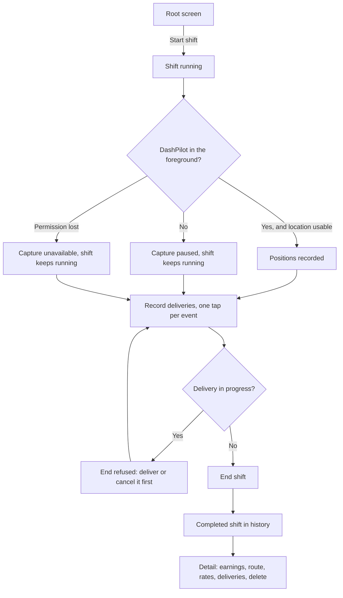

# Shift workflow

A shift is the unit everything else attaches to. This page follows one from the driver's side; the
implementation is described under [Architecture](../architecture/overview.md).



## Starting a shift

The root screen offers a start control while no shift is running. Starting records a start
timestamp and nothing else. At most one shift may be unfinished at a time, and the rule is checked
against the store, so the absence of the button is presentation and not the protection.

If the app is terminated while a shift is running, the next launch finds the same unfinished shift
and resumes it with its original start time. Nothing synthesises a replacement shift, and no
recovery step is asked of the driver.

## While a shift runs

The running shift shows an elapsed timer derived from the start timestamp, and one line describing
route capture:

| State | What it means |
| --- | --- |
| Tracking active | DashPilot is in the foreground and positions are being recorded |
| Foreground tracking paused | The app left the foreground, so capture stopped and the route has a gap |
| Permission required | Location permission has not been granted, so nothing is being recorded |
| Unavailable | Location Services is off, access is restricted, or the store refused a write |

Losing location never ends a shift. Capture becomes unavailable, the shift keeps running, and the
driver decides when it ends.

Deliberately absent from a running shift: a map, coordinates, a sample count, a live distance and a
live rate. A figure changing under a driver while they drive is not what these numbers are for, and
the useful moment for them is when the shift is finished.

## Location permission

Permission is never requested at launch. iOS shows the prompt once, and a prompt that appears
before the driver has any reason to grant it is the surest way to have it declined permanently, so
the request is always a tap.

DashPilot asks for **When In Use** only, and capture is foreground-only precisely so that stays
honest. The authorization panel states the current condition and offers only a recovery that
actually works: the prompt when permission has not been decided, the app's Settings page when it
was denied, a description of where the Location Services switch lives when the system-wide switch
is off, and nothing at all when access is restricted or already granted.

## Recording deliveries

A running shift offers one primary delivery control, and what it says depends on what the driver has
already recorded: `Start Delivery`, then `Arrived at Pickup`, `Picked Up` and `Delivered`. Nothing
is typed and nothing is detected. The full lifecycle, its rules and its limits are on
[Delivery lifecycle](delivery-lifecycle.md).

## Ending a shift

**A shift cannot be ended while one of its deliveries is in progress.** The end is refused with a
message saying to mark the delivery delivered or cancel it first — silently completing it would
record a delivery the driver never made, and silently discarding it would erase one they did.

Ending records an end timestamp. Capture is stopped and any pending positions are written before
the end is recorded, so no position is judged against a shift the store has already closed. If
ending fails, capture restarts rather than staying off.

If the device clock has moved behind the recorded start, the end is clamped to the start. Recording
a zero-length shift is preferable to leaving a driver unable to end their shift until the clock
catches up.

## History

Completed shifts appear in a list, each row a compact summary and a single tap target:

```text
Sat, Aug 23                              $86.25
5:46 PM - 8:46 PM · 3 hr
4.5 mi recorded · partial route · $28.75/hr
```

Three lines, no controls. Only figures that exist appear: an unavailable rate leaves nothing behind,
no dash and no `$0.00`. At accessibility text sizes the date and the amount stack rather than share
a line, and the summary wraps rather than truncating, because the first thing a truncation takes is
the end of "recorded", which is the word that makes the mileage honest.

## Shift detail

Tapping a row opens a screen for that shift alone. The row answers *what shift is this and roughly
how did it go*; the detail screen answers *what exactly happened* and *how trustworthy are these
numbers*.

| Section | What it holds |
| --- | --- |
| Shift | Start time, end time, elapsed duration |
| Earnings | The recorded amount or "No amount recorded", and Add or Edit Earnings |
| Route | Recorded mileage, capture segments, capture gaps, and what qualifies them |
| Performance | Both derived rates, or the reason each could not be derived |
| Deliveries | How many were completed and cancelled, and what each one recorded |
| Delete | Delete Shift, behind a confirmation |

The delivery log is last of the reading sections because it is the only one that grows with the
shift; the four above it summarise the shift in a fixed number of lines.

It is a summary, not a dashboard: no chart, no map, no gauge and no score. Only completed shifts
have a detail screen, because a running shift has no finalised duration, no earnings it may record
and nothing that may be deleted.

## Entering earnings

Earnings are entered from the detail screen, in a sheet with a field, Cancel and Save. Editing is a
draft: the typed text is view state and the store is written once, on Save or Remove. Cancel leaves
the recorded amount exactly as it was, and a refused amount keeps the sheet open with what was
typed and says which rule it broke.

Removing an amount is its own action rather than an empty field, because an empty field would
ambiguously mean both "invalid" and "delete". No amount recorded and an amount of zero are
different facts everywhere in the app.

A running shift offers nothing to type into. Typing is a task for a parked car, and the model
refuses an amount on an unfinished shift as well, because a screen that is merely never presented
is not a rule.

## Deleting a shift

Deletion is offered on the detail screen, behind an alert that names what it destroys, including
the number of route positions that go with the shift. That count is the part a driver is least
likely to have in mind and cannot re-enter by hand.

!!! danger "Deletion is permanent"

    A deleted shift is removed from the device's store together with its route positions and its
    recorded amount. There is no undo, no trash, no archive and no copy anywhere else. A shift that
    is still running cannot be deleted at all.
